# Code Forge - 设计文档

> 本文档记录 Code Forge 的设计思路、技术选型、关键决策、流程图。需求规格见 [spec.md](./spec.md)。

---

## 1. 整体架构

```
                  ┌──────────────────────────────┐
                  │  飞书客户端 (移动 / 桌面)      │
                  └───────────────┬──────────────┘
                                  │ WebSocket (长连接)
                                  ▼
                  ┌──────────────────────────────┐
                  │  飞书开放平台                   │
                  └───────────────┬──────────────┘
                                  │
                ┌─────────────────┴─────────────────┐
                ▼                                   ▼
  ┌──────────────────────────────┐    ┌────────────────────────┐
  │  Code Forge 后端 (FastAPI)    │    │  管理后台 (Vue 3)       │
  │  ┌──────────────────────────┐ │    │  - Workspace CRUD      │
  │  │ 接入层: 多App飞书WS Client│ │    │  - Skill/MCP 广场      │
  │  ├──────────────────────────┤ │    │  - 会话历史 / 配置      │
  │  │ 路由层: app_id+chat_id→ws│ │    │  - Memory 管理         │
  │  ├──────────────────────────┤ │    └────────────────────────┘
  │  │ 业务层: WS/Session/Run   │ │
  │  ├──────────────────────────┤ │
  │  │ Agent 内核: Loop + 流式   │ │
  │  ├──────────────────────────┤ │
  │  │ 工具层: 内置 / MCP / Skill│ │
  │  └──────────────────────────┘ │
  └──────────────────────────────┘
      │              │              │
      ▼              ▼              ▼
  ┌────────┐   ┌─────────┐   ┌────────────────────────┐
  │Postgre │   │ Redis   │   │ 文件系统                │
  │元数据/ │   │任务队列/│   │ /workspaces/{ws_id}/   │
  │会话/配置│   │事件总线/│   │ /skills/{skill_id}/   │
  │        │   │缓存     │   │   (全局广场)            │
  └────────┘   └─────────┘   └────────────────────────┘
                                       │
                                       ▼
                            ┌────────────────────────┐
                            │ 外部 MCP 服务           │
                            │ (stdio / http)         │
                            └────────────────────────┘
```

---

## 2. 核心概念

### 2.1 实体关系

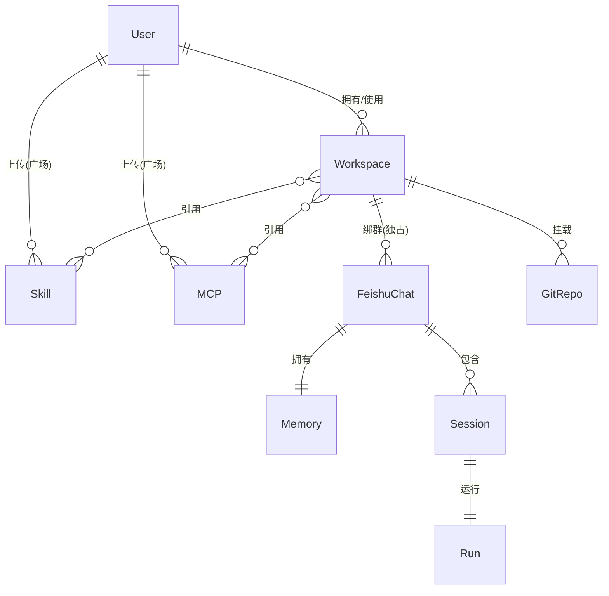

**关系多重性说明**：

| 关系 | 左 → 右 | 右 → 左 | 业务语义 |
|---|---|---|---|
| User ↔ Workspace | 1 → N | N → 1 | 1 用户拥有 / 使用 N 个 WS；1 WS 归属 1 用户 |
| User ↔ Skill | 1 → N | N → 1 | 1 用户可上传 N 个 Skill；1 Skill 归属 1 owner |
| User ↔ MCP | 1 → N | N → 1 | 同上 |
| **Workspace ↔ FeishuChat** | **1 → N** | **1 → 1（独占）** | **1 WS 可绑多个 FeishuChat；1 FeishuChat 只能绑 1 WS** |
| Workspace ↔ GitRepo | 1 → N | N → 1 | 1 WS 可挂多个 repo；1 repo 归属 1 WS |
| Workspace ↔ Skill | N ↔ N | — | 多对多，通过 `workspace_skill` 关联表 |
| Workspace ↔ MCP | N ↔ N | — | 同上 |
| FeishuChat ↔ Memory | 1 → 1 | 1 → 1 | 1 chat 对应 1 份 memory 目录 |
| FeishuChat ↔ Session | 1 → N | N → 1 | 1 chat 可有多次会话（1 session = 1 run） |
| Session ↔ Run | 1 → 1 | 1 → 1 | 1 session 对应 1 run |

**关键约束**：

- **chat 独占 WS**：1 个 FeishuChat 实体（由 `app_id + chat_id` 唯一确定）只能绑 1 个 WS。同一项目可以绑多个群（开发群 / 测试群 / ...），但反过来不允许同一 FeishuChat 挂多个 WS
- **多机器人一群**：1 个飞书群可以通过加多个机器人（多个 `app_id`）实现"绑多 WS"——每个 `(app_id, chat_id)` 对是一个独立 FeishuChat，各自绑一个 WS
- **Memory 隶属 chat**：1 FeishuChat 1 份 memory 目录，跨 session 持久，跨 FeishuChat 隔离
- **Skill / MCP 是顶层实体**：存于全局广场，WS 通过关联表 N:N 引用
- **WS 级配置（workspace_settings）**：承载 WS 级配置，含上下文管理策略（D34：启用开关 / clearing 与 compaction 阈值 / `clear_keep` / `compact_recent` / 摘要模型 / instructions / `exclude_tools`）；存 DB 便于后台编辑，可作 `workspaces` 表 JSON 字段或独立表

### 2.2 概念定义

| 概念 | 定义 | 形态 |
|---|---|---|
| **Workspace** | 物理实体，独立隔离单元 | 文件目录 + DB 记录 |
| **FeishuChat** | WS 的逻辑接入点，唯一键 `(app_id, chat_id)`；仅群聊；FeishuChat 独占 WS 不共享 | DB 记录 |
| **GitRepo** | 项目代码仓库，1 WS 可绑多个（用户自选数量） | 文件目录（git clone）+ DB 记录 |
| **Skill** | 一个目录（SKILL.md + resources + 可选脚本），存于全局广场 | 文件目录（全局） |
| **MCP** | 外部工具服务（stdio / http），存于全局广场 | DB 配置（全局）+ 客户端连接 |
| **Memory** | Chat 级长期记忆，跨 session 持久 | 文件目录（`chats/{feishu_chat_id}/memory/`） |
| **Session** | 上下文单元，独立的对话历史；1 session = 1 run | DB 记录 + JSONL |
| **Run** | 一次 Agent Loop 实例（用户发一条消息触发 Agent 跑一轮） | DB 记录 + 异步任务 |

### 2.3 工作空间目录结构

```
/workspaces/{ws_id}/                # 物理工作空间
  ├── workspace.toml                # 配置(引用 repos/skills/mcps/chats)
  ├── AGENT.md                      # WS 级项目指令(详见 D24,Run 启动时注入)
  ├── repos/                        # 多 repo 父目录(Agent 默认 cwd = 第一个挂载 repo 根,见 D24)
  │   └── {repo_id}/                # 每个 repo 一个子目录
  │       ├── .git/
  │       ├── AGENT.md              # Repo 级项目指令(随 git 同步,详见 D24)
  │       └── <文件>
  ├── chats/{feishu_chat_id}/       # FeishuChat 内部ID((app_id,chat_id) 唯一)
  │   ├── memory/                   # Memory 目录(跨 session 持久)
  │   │   ├── MEMORY.md             # 索引(Agent Loop 启动时注入)
  │   │   ├── user_*.md             # 角色与偏好
  │   │   ├── feedback_*.md         # 反馈与纠正
  │   │   ├── project_*.md          # 项目动态
  │   │   └── reference_*.md        # 外部系统指针
  │   ├── sessions/                 # 会话历史(JSONL)
  │   │   └── {session_id}.jsonl
  │   └── traces/                   # Trace payload(可观测性,详见 D29 / §7)
  │       └── {trace_id}/           # 1 Run 1 子目录(LLM/tool/skill 各 span 的 payload 文件)
  └── logs/

/skills/{skill_id}/                 # 全局广场(跨 WS 共享)
  ├── SKILL.md
  ├── resources/
  └── scripts/
```

**说明**：

- `repos/` 是工具调用允许访问的唯一代码子树（详见 D17）
- `AGENT.md` 是 WS 级与 Repo 级项目指令文件，由后端在 Run 启动时直接读取并注入 system prompt（不走工具调用，详见 D24）
- `chats/{feishu_chat_id}/` 隔离不同 FeishuChat 的 memory 与 session，互相不可访问；同一飞书群在多机器人场景下会有多个 feishu_chat_id（每个 `app_id` 一个）
- 全局广场 `/skills/` 与 WS 平级，WS 通过挂载引用

---

## 3. 技术选型

### 3.1 后端

| 组件 | 选型 | 说明 |
|---|---|---|
| 语言 | Python 3.11+ | 异步生态成熟，LLM SDK 一等支持 |
| Web 框架 | FastAPI | 原生异步、OpenAPI 自动生成 |
| LLM SDK | anthropic SDK | MVP 先支持 Claude，抽象 Provider 层 |
| 飞书 SDK | lark-oapi | 官方 Python SDK，支持 WebSocket 模式 |
| ORM | SQLAlchemy 2.x | 异步支持完善 |
| Migration | Alembic | SQLAlchemy 配套 |
| 异步任务 | asyncio + Redis 队列 | MVP 不引入 Celery，简化部署 |

### 3.2 前端（管理后台）

| 组件 | 选型 |
|---|---|
| 框架 | Vue 3 (Composition API) |
| UI 库 | Element Plus |
| 状态管理 | Pinia |
| 路由 | Vue Router |
| 构建 | Vite |

### 3.3 存储

| 类型 | 选型 | 用途 |
|---|---|---|
| 关系数据库 | PostgreSQL | 元数据、会话、配置 |
| 缓存 / 队列 | Redis | 任务状态、消息队列、事件总线 |
| 文件系统 | 本地磁盘 | 工作空间目录、全局广场 |

### 3.4 部署

| 阶段 | 方案 |
|---|---|
| MVP | Docker Compose |
| 生产 | K8s |

### 3.5 项目结构与模块划分

Monorepo：前后端 + 部署配置同仓。本节定目录骨架与模块边界，作为脚手架任务（task T0.1 / T0.2）的依据。

**顶层结构**：

```
code-forge/
├── backend/        # FastAPI 后端（Python 3.11+，uv 管理依赖）
├── frontend/       # Vue 3 管理后台（pnpm）
├── deploy/         # docker-compose / k8s / .env.example
├── docs/           # spec / design / api / task
├── .github/        # CI（lint / test / alembic check）
└── README.md
```

**后端结构**（分层 + 按业务域组织，对应 §1 架构分层与 §5 模块清单）：

```
backend/
├── pyproject.toml              # uv 管理依赖
├── alembic/ {versions, env.py} # 迁移（T1.2）
├── app/
│   ├── main.py                 # FastAPI 入口 + 生命周期（启动恢复 D36、飞书 WS 池起停）
│   ├── config.py               # pydantic-settings，环境分 dev/prod
│   ├── core/                   # 横切基础设施（跨模块共用）
│   │   ├── logging.py          # 结构化日志 jsonl
│   │   ├── security.py         # 凭证加密 / 脱敏 / CSRF（D30 / D32 / NF4.2）
│   │   ├── deps.py             # FastAPI 依赖：require_user / owner / admin（T1.5）
│   │   └── recovery.py         # 启动恢复：孤儿 Run / 锁 / 异步任务（D36）
│   ├── db/                     # M6 持久化
│   │   ├── base.py / session.py
│   │   ├── models/             # ORM：users / workspaces / feishu_chats / spans / workspace_settings ...
│   │   └── tenant.py           # spans 查询强制注入 ws_id（D31）
│   ├── api/                    # HTTP 接口层（M5 后台 API，对接 api.md）
│   │   └── auth/ workspaces/ skills/ mcps/ feishu_apps/ users/ observability/ memory/
│   ├── feishu/                 # M1 接入层
│   │   ├── client.py           # lark-oapi 封装（tenant token / IM API）
│   │   ├── ws_pool.py          # 多 App WebSocket 连接池（D7）
│   │   ├── router.py           # (app_id, chat_id) → ws_id 路由（D8）
│   │   ├── cards.py            # 富卡片渲染（D4）
│   │   └── dedup.py            # 消息去重（D38）
│   ├── agent/                  # M2 Agent 内核
│   │   ├── loop.py             # Agentic Loop（§6.5）
│   │   ├── run.py              # Session:Run = 1:1（D23）
│   │   ├── context.py          # 上下文管理四道防线（D34）
│   │   ├── lock.py             # WS 写锁 + 可重入（D20 / D33）
│   │   ├── queue.py            # Run 队列 + 排队 / 中断反馈（§6.6）
│   │   ├── subagent.py         # 并行子代理（D33）
│   │   └── prompt.py           # system prompt 构建 + 注入顺序（D24）
│   ├── providers/              # M2 LLM 抽象（D3）
│   │   ├── base.py             # Provider 接口 + TokenCounter + context_window
│   │   ├── anthropic_provider.py
│   │   └── glm_provider.py     # 国内模型备选（规避封禁）
│   ├── tools/                  # M3 工具层
│   │   ├── base.py / registry.py
│   │   ├── path_guard.py       # resolve_within 路径安全（D17）
│   │   ├── builtin/            # Read / Write / Edit / Glob / Grep / Bash / WebFetch / TaskList / Agent ...
│   │   ├── mcp/                # MCP 客户端 + 进程生命周期（D37）
│   │   └── skill.py            # skill__{name} 按需加载（D16）
│   ├── workspace/              # M4 工作空间管理
│   │   ├── manager.py          # WS 创建 / 目录骨架 / 级联删除
│   │   ├── git.py              # HTTPS clone / 同步 / Bash git 边界（D6 / D35）
│   │   └── fs.py               # 目录工具 + resolve 校验（D17）
│   ├── memory/                 # chat memory 读写（D18 / D22）
│   ├── observability/          # M8
│   │   ├── tracer.py           # contextvars span（D28 / §7.3）
│   │   ├── buffer.py           # SpanBuffer 批写 + 降级（§7.4）
│   │   ├── payload.py          # 落盘 / 截断 / 脱敏（§7.5 / §7.6）
│   │   └── cost.py             # cost 引擎（§7.7）
│   └── tasks/                  # 异步任务（git clone / 级联删除；asyncio + Redis，不引入 Celery）
└── tests/
```

**前端结构**（Vue 3 管理后台）：

```
frontend/
├── package.json               # pnpm
├── vite.config.ts
└── src/
    ├── main.ts / App.vue
    ├── router/                # 路由 + 守卫（未登录 / 401 跳登录）
    ├── stores/                # Pinia（user / ws）
    ├── api/                   # axios 封装 + 各资源客户端（对接 api.md）
    ├── views/                 # auth / workspaces / skills / observability / memory / users
    ├── components/
    ├── composables/
    └── types/
```

**模块 M1–M8 到后端目录映射**：

| 模块（§5） | 后端目录 | 关键职责 |
|---|---|---|
| M1 飞书接入层 | `app/feishu/` | WS 连接池 / 路由 / 卡片 / 去重 |
| M2 Agent 内核 | `app/agent/` + `app/providers/` | Loop / Run / 上下文 / 锁 / 子代理 / LLM 抽象 |
| M3 工具层 | `app/tools/` | 内置工具 / MCP / Skill / 路径安全 |
| M4 工作空间管理 | `app/workspace/` | 目录 / git / FeishuChat 绑定 |
| M5 管理后台 | `app/api/` + `frontend/` | 后台 API + Vue 前端 |
| M6 持久化 | `app/db/` + `app/memory/` | ORM / memory 文件组织 |
| M7 鉴权 | `app/api/auth/` + `app/core/{security,deps}.py` | 账号密码 / owner 校验 / session |
| M8 可观测性 | `app/observability/` | tracer / buffer / payload / cost |

**分层与依赖约定**：

- **分层**：`api`（HTTP 边界）→ 业务域（`agent` / `workspace` / `feishu` / `tools` / `memory`）→ 基础设施（`db` / `providers` / `observability` / `tasks`），**单向依赖**，禁止反向（基础设施不依赖业务域）
- **横切逻辑归 `core/`**（日志 / 安全 / 依赖注入 / 启动恢复），不散落在各业务域
- **模块内自治**：各业务域目录内按需再分 model / service，避免一开始过度拆分；目录边界 = 模块边界 = §5 的 M1–M8
- **飞书侧与后台侧解耦**：飞书交互（`feishu/`，WebSocket）与管理后台（`api/`，HTTP）是两条独立入口，共享 `agent` / `workspace` 业务层，不互相调用

---

## 4. 关键决策记录

### D1: 部署形态 = 云端 Web 服务

- **理由**：支持 7x24 在线、移动端访问、多设备同步
- **权衡**：开发成本高于本地 CLI，但适配飞书移动场景

### D2: 使用范围 = 对外服务（多租户）

- **理由**：长期目标是对外服务，架构需要早期预留
- **MVP 策略**：先做 "准多租户" 版本（架构预留，账号由管理员开通），暂不做完整计费 / 审计

### D3: LLM 选型 = 多模型可切换

- **理由**：避免厂商锁定，灵活适配不同场景；Claude 对国内封禁，Provider 层必须支持国内模型（如 GLM）作为主模型与摘要模型的备选
- **MVP 策略**：先 Claude（生态最匹配 Tool Use），抽象 Provider 层为后续多模型铺路；上下文管理（D34）自研且 Provider 无关，主模型 / 摘要模型切换到 GLM 等国内模型时上下文管理机制照常工作

### D4: 飞书交互深度 = 文本 + 富卡片

- **理由**：Coding 任务需要 diff 预览、确认按钮等富交互
- **关键卡片类型**：diff 预览、Plan 确认、进度反馈、TaskList

### D5: 代码执行 = 不用沙箱，工作空间作为软隔离

- **理由**：简化 MVP，用户自己把控风险
- **隔离方式**：路径前缀校验，工作空间之间互不可见
- **不提供**：CPU / 内存 / 网络限制

### D6: 项目代码来源 = 多 Repo + HTTPS clone（无 OAuth）

- **关系**：1 WS : N GitRepo，用户自选数量（0~N）
- **理由**：简化认证流程；多 repo 支持微服务 / 前后端等场景
- **支持**：可选 token 用于私有仓库
- **Agent cwd**：默认在第一个挂载 repo 的根目录（`repos/{repo_id}/`，详见 D24）；MVP 单 repo 内活动，工具用相对路径即可，不跨 repo
- **跨 repo 操作**：MVP 不支持，Agent 在单 repo 内活动

### D7: 飞书应用 = 企业自建应用，支持多 App 配置

- **理由**：最灵活，无需审核
- **场景**：每个企业独立安装
- **多 App 支持**：后端维护一张 `feishu_app` 表（`app_id` + `app_secret` + owner），每个 App 对应一个飞书自建应用（一个机器人）
- **接入层**：每个 App 启动一个独立的飞书 WebSocket 长连接（多 Client 池），共享同一接入层调度
- **理由**：实现"同一群挂多 WS"必须有多 App 支持（详见 D8 多机器人一群）

### D8: Workspace 与 FeishuChat 关系 = 1:N，FeishuChat 独占

- **模型**：WS（物理）→ FeishuChat（逻辑接入点）；1 WS 可绑 N 个 FeishuChat（开发群 / 测试群 / ...）
- **FeishuChat 唯一键**：`(app_id, chat_id)` 联合唯一（一个机器人 + 一个群 = 一个 FeishuChat）
- **独占约束**：1 个 FeishuChat 只能绑 1 个 WS，不允许跨 WS 共享
- **多机器人一群**：用户可以通过"在同一个群里加多个机器人（多个 `app_id`）"实现"一群挂多 WS"——每个 `(app_id, chat_id)` 对是一个独立 FeishuChat，各自绑不同的 WS。从 Code Forge 视角看，仍是 1 FeishuChat : 1 WS
- **聊天类型**：MVP 仅支持群聊，私聊暂不做
- **绑定输入**：管理员在后台选择已注册的飞书 App + 粘贴 chat_id，后端校验合法性 + 机器人是否在群
- **理由**：1:N 让同一工作空间接入多个团队场景；FeishuChat 独占避免路由歧义；多机器人机制让"一群多 WS"在物理层成立而模型层不变

### D9: 后端语言 = Python

- **理由**：anthropic SDK 一等支持，异步处理方便，生态成熟

### D10: 工作空间管理 = Web 管理后台

- **理由**：交互体验优于纯飞书命令

### D11: MCP / Skill = 全局广场 + 用户上传 + WS 引用挂载

- **广场**：Skill / MCP 是顶层实体，存在全局目录（`/skills/`、DB 中的 MCP 表），跨 WS 共享
- **上传**：用户可上传（无需审核，立即可用）；owner 才能编辑 / 删除
- **挂载**：WS 通过关联表引用广场资源，N:N 关系
- **删除策略**：被引用时禁删，必须先解绑所有 WS
- **可见性**：默认 owner 私有，可设"全员可见"开关
- **版本（MVP 无版本管理）**：作者更新 SKILL.md 后对所有挂载 WS **即时生效**（下次 Run 注入新内容）；不提供版本快照 / 回滚 / 钉版本——挂载方需知悉被引用 Skill 可被作者随时修改（spec F3.5.8）
- **理由**：避免重复存储；用户驱动的生态而非管理员审核

### D12: 后台技术栈 = Vue 3 + Element Plus

- **理由**：团队熟悉 Vue 生态

### D13: 聊天场景 = 群聊为主（MVP）

- **挑战**：群聊需要处理多用户权限、@识别（详见 D21）

### D14: Run 调度 = 同 WS 多 Run 共存（写串行）

- **挑战**：并行 Run 改同一份代码会冲突，详见 D20
- **方案**：WS 写锁串行 + Run 队列反馈（详见 D20 + §6.6）

### D15: Skill 形态 = 一个目录

- **理由**：跟 Claude Code 一致，表达力强
- **目录结构**：

  ```
  /skills/{skill_id}/
    ├── SKILL.md          # 主入口（必需）
    ├── resources/        # 资源文件（模板 / 配置示例 / 参考文档，可选）
    └── scripts/          # 可执行脚本（可选）
  ```

- **SKILL.md 标准结构**：

  ````markdown
  ---
  name: <skill_name>           # 必需，全局唯一（在 WS 内）
  description: <一句话描述>     # 必需，注入 system prompt，决定模型是否调用
  ---

  # <Skill 名称>

  ## 何时使用
  <触发场景描述>

  ## 工作流程
  1. <步骤 1，含脚本调用 / 资源读取路径>
  2. <步骤 2>

  ## 脚本说明（如有）
  - `scripts/<name>.py`：<用途>

  ## 注意事项
  <约束 / 边界条件>
  ````

- **frontmatter 字段**：
  - `name`：Skill 标识，全局唯一（在 WS 挂载范围内）
  - `description`：一句话，注入 system prompt（必须精炼，决定召回率）
- **正文约定**：
  - 必须明确告知 Agent 脚本调用路径（绝对路径 `/skills/{skill_id}/scripts/...`）
  - 必须明确告知 Agent 资源读取路径（`/skills/{skill_id}/resources/...`）
  - 不写脚本源码（脚本独立放在 `scripts/`）

### D16: Skill 加载策略 = 按需 invoke（3 阶段渐进式）

**核心思路**：把 Skill 的元信息 / 完整内容 / 执行依赖分层加载，避免 system prompt 膨胀。

#### 阶段 1：System Prompt 元信息注入（启动时）

- **何时加载**：WS 启动 / Skill 挂载 / 解绑时
- **加载内容**：仅 frontmatter 的 `name + description`，每个 Skill 一行
- **注入位置**：system prompt
- **示例**：

  ```
  可用的 Skills:
  - python-test: 生成 Python 单元测试
  - code-review: 代码审查，检查常见问题
  ```

- **挂载数量上限**：单 WS 最多 50 个 Skill；实际 system prompt 占用**取决于 description 长度**（建议每条 ≤ 100 token，50 条约 5K token；description 无硬约束时可能更高，上传时后端给出长度告警）

#### 阶段 2：完整 SKILL.md 加载（Agent invoke 时）

- **何时加载**：模型基于 description 判断需要调用 → 触发 `skill__{name}` 工具
- **加载内容**：完整 `SKILL.md`（含 frontmatter + 正文）
- **加载方式**：后端读取 `/skills/{skill_id}/SKILL.md` → 作为 `tool_result` 返回
- **效果**：Agent 看到完整工作流程、脚本路径、资源路径

#### 阶段 3：脚本 / 资源按需访问（Agent 自主驱动）

| 类型 | 访问方式 | 说明 |
|---|---|---|
| `scripts/*.py` / `*.sh` | Agent 调用 `Bash` 执行 | 脚本不进入上下文，只执行；输出通过 `tool_result` 返回 |
| `resources/*` | Agent 调用 `Read` 读取 | 模板 / 配置示例按需读取，不预加载 |

**关键设计**：
- 脚本是"被执行的"，不是"被加载的"
- 资源是"被按需读取的"，不是"被预加载的"
- 所有路径都在 SKILL.md 正文里告知 Agent

#### 加载示例

```
WS-Frontend 挂载 python-test Skill

1. WS 启动 → 注入 system prompt
   "python-test: 生成 Python 单元测试"

2. 用户："给 login.py 写测试"

3. Agent 决定调用 → tool_use: skill__python-test

4. 后端 Read /skills/python-test/SKILL.md → 返回 tool_result

5. Agent 看到 SKILL.md 工作流，按步骤执行：
   - Bash: bash /skills/python-test/scripts/analyze.py login.py
   - Read: /skills/python-test/resources/test_template.py
   - Write: login_test.py
```

#### 长期演进：二阶段召回

- 超过 50 个 Skill 时，用 embedding 召回 top-K 注入 system prompt
- MVP 不做

### D17: WS 内路径安全 = 工具调用强制限定在 repos/ 子树

- **校验**：所有工具调用的路径必须 resolve 后落在 `/workspaces/{ws_id}/repos/` 子树下
- **禁止**：越界访问其他 WS、系统目录、`/skills/` 全局广场、`chats/` 子树
- **理由**：D5 决定不用沙箱，路径校验作为软隔离手段

### D18: Memory 作用域 = FeishuChat 级（跨 session 持久，跨 FeishuChat 隔离）

- **作用域**：Memory 以 FeishuChat 为隔离单元
- **目录**：`/workspaces/{ws_id}/chats/{feishu_chat_id}/memory/`
- **理由**：
  - FeishuChat 是飞书的逻辑接入点，1 WS : N FeishuChat（D8），不同 FeishuChat 场景差异大（开发群 vs 测试群）
  - FeishuChat 级隔离天然避免群聊多用户归属问题
  - 跨 session 持久让 Agent 在同一 FeishuChat 内能记住历史决策与用户偏好
- **群聊场景**：同一 FeishuChat 内多用户共享 memory（A 说的偏好，B 触发时 Agent 也会用）

### D19: Memory 写入方式 = 复用内置 Write / Edit（不提供专门 memory 工具）

- **方式**：Agent 通过内置 Write / Edit 直接落盘到 `chats/{feishu_chat_id}/memory/`
- **加载**：Agent Loop 启动时自动把 `MEMORY.md` 索引注入 system prompt（具体文件按需 Read）
- **理由**：跟 Claude Code 一致，工具集合更精简，Agent 学习成本低
- **后台管理**：管理员在管理后台编辑 / 删除 memory 文件（按 FeishuChat 维度组织）

### D20: WS 写锁 = 工作空间级串行写操作

- **背景**：1 WS 可绑 N FeishuChat（D8），多 FeishuChat 触发的 Run 共享同一 `repos/` 子树，并行修改会冲突覆盖
- **方案**：工作空间级写锁 + Run 排队
- **锁实现**：Redis 分布式锁 `ws_lock:{ws_id}`
- **抢锁范围**：

  | 工具 | 是否抢锁 | 说明 |
  |---|---|---|
  | `Write` / `Edit` | ✅ | 直接写文件 |
  | `Bash` | ✅ | 无法静态判断读 / 写（`ls`、`ls && rm` 难区分），无脑全抢 |
  | `Read` / `Glob` / `Grep` | ❌ | 只读，并行安全 |
  | `skill__{name}` | ❌ | 仅加载内容到上下文 |
  | `WebFetch` / `WebSearch` | ❌ | 网络访问 |
  | `TaskList` 系列 | ❌ | Agent 内部 todos，无副作用 |
  | `Agent`（子代理） | 可重入 | 复用父 Run 已持有的 `ws_lock`，不重复抢；子代理内写工具调用也不再单独抢锁（详见 D33） |

- **生命周期**：
  - 入队：Run 创建后入队，尝试抢锁；抢不到则等待
  - 持有：抢到锁后整个 Run 期间持有（不是单次工具调用粒度）；Run 内启动的并行子代理**可重入**复用此锁、不重复抢（避免子代理间死锁，详见 D33）
  - 释放：`try / finally` 保证异常 / 中断 / 超时都释放
- **超时**：硬上限 10 分钟（兜底防死锁；正常 Run < 5 min）
- **中断**：
  - 排队中可取消：用户点飞书"取消排队"按钮，从队列移除
  - 运行中可中断：信号传到 Agent Loop，异步中止 + 释放锁
- **反馈**：
  - ⏳ 入队时推送"排队中，前面 N 个"
  - ▶️ 抢到锁时推送"开始执行"
- **理由**：MVP 简单粗暴；真实场景下同一 WS 并行触发概率不高，串行体验可接受；后续如成瓶颈可演进到 repo 级锁或 git worktree
- **与 D33 的关系**：D20 保证 **Run 间**串行（同 WS 一次只跑一个 Run 的写临界区）；D33 解决 **Run 内**并行子代理——子代理可重入进入父 Run 临界区，只读天然并行，写型子代理之间不二次串行（依赖主 Agent 拆分时避免写冲突）。worktree 级锁是 P2 演进方向

### D21: 群聊权限 = 无权限模型（拉群即用）

- **规则**：飞书群成员资格 = Agent 使用权；任何人 @ 机器人都能触发 Run
- **不做的事**：
  - 不做角色区分（不区分管理员 / 参与者）
  - 不做用户级权限校验
  - 不做飞书 chat 内的功能限制
- **控制权移交飞书原生**：谁能拉机器人 / 拉人进群，由飞书群管理员设置控制
- **保留的管理后台权限**：WS 配置 / Skill 上传 / Memory 管理等仍需 owner 校验（spec F3.8.2），与飞书群内使用权是两层
- **理由**：
  - 简化 MVP，避免权限模型膨胀
  - 跟 IM 工具使用习惯一致（拉群即共享）
  - 真正的权限边界是 WS 物理隔离（路径校验，详见 D17），不是用户级

### D22: Memory 写入策略 = Agent 自主判断 + 强信号触发

- **核心机制**：Agent 自主判断对话中的重要信息，主动写入 memory；用户不需要显式说"记住 X"
- **强信号触发条件**（任一满足即写入）：

  | 类型 | 触发条件 | 示例 |
  |---|---|---|
  | **显式指令** | 用户说"记住 X" / "记一下" / "别忘了" | "记住我们用 ruff 不用 black" |
  | **纠正型 feedback** | 用户说"不对" / "错了" / "应该是 X 不是 Y" | Agent 用 black，用户说"不对，用 ruff" |
  | **重复偏好** | 同类偏好出现 ≥ 2 次 | 用户连续 3 次要求加 type hints |
  | **强烈情绪** | 用户说"千万别" / "求你别" / "一定要" | "求你别再用 print 调试" |
  | **主动告知** | 用户介绍自己 / 项目 / 外部系统 | "我是后端，主要写 Python" / "CI 在 X 地址" |

- **不写的场景**：

  | 场景 | 理由 |
  |---|---|
  | 代码本身的状态（"改了多少行"） | git 已记录，重复 |
  | 弱信号（用户随口提到的） | 噪音多，价值低 |
  | 敏感信息（密钥、密码、token） | 安全风险 |
  | 临时上下文（"今天会议延期"） | 时效短 |

- **防过度记录**：
  - **同主题合并**：写入前 Read 同主题已有文件，追加而非新建
  - **更新优先**：偏好变化就改原文件，不另起一份
  - **告知用户**：每次隐式写入回复"已记下 X"（用户可后台否决）
  - **不做容量硬限制**：依赖同主题合并 + 用户后台编辑自然消化

- **System Prompt 指令**：Agent 在 system prompt 里收到明确的写入规则（类似 Claude Code 的 memory 规则），知道什么场景写、写哪类、写完怎么反馈

- **群聊场景归属**（原"待细化"，现定默认）：
  - **接受群内共享**：同一 FeishuChat 内 A 说的偏好，B 触发时 Agent 也用（D18 已定）
  - **标注来源用户**：写入 `user` / `feedback` 类 memory 时，记录飞书 sender name（如"alice 偏好 ruff"），便于多用户场景溯源与后台人工裁决
  - **冲突处理**：多人偏好冲突时（A 喜欢黑、B 喜欢白），**后写覆盖**——接受"最后发言者偏好优先"，MVP 不做人多偏好仲裁；用户可在后台编辑 memory 修正
- **并发写入安全**（配合 D20 / D33）：
  - **风险**：D20 规定 `Write`/`Edit` 抢 WS 锁，但 D33 子代理可重入不抢锁 → 多个写型子代理并发写同一 memory 文件 / `MEMORY.md` 索引会互相覆盖、丢数据
  - **约束**：**memory 写入由主 Agent 收口**——子代理不直接落盘 memory，只回最终结果给主 Agent；由主 Agent 统一判断是否写 memory（主 Agent 持锁、串行写，天然无冲突）
  - **理由**：子代理本就"仅回最终消息"（D33），让其顺带写 memory 既违反独立上下文原则、又引入并发风险；主 Agent 收口最自然
- **陈旧性校验**（spec F3.6.7）：
  - **风险**：Memory 跨 session 持久累积，引用的文件 / 函数 / 配置 / 命令可能已被改动或删除；Agent 若直接推荐会给出失效建议（如推荐已删的文件、已重命名的函数）
  - **策略**（system prompt 指令层 + 轻量主动核验）：
    - system prompt 明确要求：推荐前对 memory 引用的路径 / 符号做存在性核验（用 `Read` / `Grep` 确认文件与函数仍在）
    - 核验通过才推荐；核验失败则降级表述为"曾经有 X（可能已变更，建议先确认）"，不当事实直接输出
    - 不做全量 memory 扫描（成本高），仅在 Agent 主动引用某条 memory 时按需核验
  - **理由**：MVP 不做 memory 自动失效 / 重写（成本高），按需核验即可覆盖绝大多数失效场景；与 task T7.4 对齐
- **理由**：
  - 等同 hermes agent 的全自动 memory 模式，降低用户认知负担
  - 用户不需要记 "什么时候要告诉 Agent 记住"
  - 强信号触发条件清晰，避免 Agent 滥写或漏写
- **待细化**：
  - System prompt 中给 Agent 的 memory 写入指令的具体措辞

### D23: 会话语义 = 1 Session : 1 Run

- **规则**：1 个 Session 严格对应 1 个 Run；用户每次发消息触发的新 Agent Loop 都是新 Session + 新 Run
- **不做的事**：
  - 不做会话内多 Run（一个 Session 跑多个并行 Run）
  - 不做多 Session 共享上下文窗口
- **Memory 跨 Session 持久**：Run 结束后 Session 历史落盘（JSONL），Memory 文件持续生效；下次同 FeishuChat 触发新 Run 时自动加载
- **理由**：
  - 实现最简单，避免上下文窗口管理与并发 Run 的耦合
  - 多并行 Run（如多 FeishuChat 同时触发）= 多个独立 Session，互不干扰
  - 跨 Run 的"记忆"由 Memory 系统承担，而非共享上下文窗口

### D24: AGENT.md = 项目级指令文件（WS 级 + Repo 级）

**定位**：类似 Claude Code 的 `CLAUDE.md` / Codex 的 `AGENT.md`，让 WS 自带"项目手册"，Agent 在 Run 启动时自动读取并注入 system prompt，作为长期、稳定的指令上下文。

**与 Memory 的区别**：

| 维度 | AGENT.md | Memory |
|---|---|---|
| 内容 | 项目背景 / 编码规范 / 常用命令 / 注意事项（人写） | 用户偏好 / 反馈纠正 / 项目动态 / 外部指针（Agent 写） |
| 作用域 | WS 级 + Repo 级 | FeishuChat 级 |
| 写入者 | 管理员（手工 / git 同步）；Agent 可补写 | Agent 自主判断 + 强信号触发（D22） |
| 加载 | Run 启动时整文件注入 system prompt | Run 启动时仅注入 `MEMORY.md` 索引，详情按需 Read |

#### 文件位置

- **WS 级**：`/workspaces/{ws_id}/AGENT.md`（描述整个工作空间通用规则，1 WS 至多 1 份）
- **Repo 级**：`/workspaces/{ws_id}/repos/{repo_id}/AGENT.md`（每个 repo 根目录 1 份，随 git 同步）

#### 加载策略

- **触发**：Run 启动时由后端**直接读取并注入 system prompt**（不走 Read 工具）
- **加载范围**：
  - **WS 级 AGENT.md**：必加载（若存在）
  - **Repo 级 AGENT.md**：仅加载**当前 cwd 所在 repo** 的那一份（多 repo 不拼接）
- **cwd 默认值**：第一个挂载 repo 的根目录；后续可在管理后台为每个 FeishuChat 配置默认 cwd
- **注入顺序**（从通用到具体）：

  ```
  1. 系统基础指令（角色 / 安全约束）
  2. WS 级 AGENT.md
  3. Repo 级 AGENT.md（当前 cwd）
  4. MEMORY.md 索引（chat 级长期记忆）
  5. Skill descriptions（可调用能力）
  ```

#### 路径安全

- **加载阶段**：后端启动 Run 时直接读取文件并注入（不走工具调用，不受 D17 路径校验约束）
- **Agent 修改**：允许 Agent 通过 Write / Edit 修改两份 AGENT.md，路径白名单精确到这两条文件路径（不开放整个父目录写权限）
- **理由**：让 Agent 在工作中能补写"发现的规范"（如检测到 lint 规则、测试命令），与 Claude Code 行为一致

#### 管理后台

- **WS 级 AGENT.md**：管理后台支持在线查看 / 编辑（属 WS 配置范畴）
- **Repo 级 AGENT.md**：随 git clone 进入，由用户在源仓库维护；后台只读视图（不双向同步）

#### 长度保护

- 单份 AGENT.md 建议 ≤ 2K token（约 1500 字中文 / 6000 字符英文）
- 超长时后端记录告警但仍正常加载（不强制截断，避免破坏指令完整性）

### D25: 可观测性存储 = 自建（PG 结构化 + 文件 payload），不引入第三方平台

- **理由**：Code Forge 强调多租户物理隔离（NF4.1），trace 数据含 prompt / 工具输入（可能含代码片段），送第三方平台（Langfuse / LangSmith 云版）有数据外泄风险；自建可完全控制 TTL / 脱敏 / 多租户边界；且 PG + 本地文件系统已是现有栈，无新依赖
- **方案**：
  - 结构化元数据（token / 延迟 / cost / 状态 / 错误）入 PostgreSQL `spans` 表（D27）
  - 完整大 payload（prompt / response / tool_result）落本地文件系统 `chats/{feishu_chat_id}/traces/{trace_id}/`（D29）
  - PG 记录只存 `payload_ref` 文件路径引用
  - 字段对齐 OpenTelemetry GenAI semantic conventions（`gen_ai.*`）+ anthropic usage，便于未来导出 OTel
- **详设**：§7.2 / §7.5

### D26: 采集粒度 = 分层（元数据入 PG，大 payload 落文件）

- **理由**：大 payload（Bash 输出、流式响应）塞 PG 会导致表膨胀、查询变慢；分层后结构化数据可高效聚合，大 payload 按需懒加载
- **方案**：
  - PG `spans` 表只存元数据 + token 计数 + cost + 状态 + 错误 + payload 文件引用
  - 完整 prompt / response / tool_result 落文件，管理后台调试时按需读取
  - 大 payload 截断：LLM request ≤ 5MB / response ≤ 10MB / tool 输出 ≤ 1MB（NF4.6.4）
- **详设**：§7.2 / §7.5

### D27: Trace 数据模型 = span 树（单表自引用，支持任意嵌套）

- **理由**：子代理（Agent 工具）会递归产生 LLM / 工具调用，span 树是最自然的表达；单表自引用避免 JOIN，字段统一便于聚合，根 span 即 Run，与「1 Session : 1 Run」（D23）严格对应
- **方案**：
  - 单表 `spans`，字段 `span_id` / `trace_id` / `parent_span_id` / `span_type` / `span_order`
  - span 类型：`run`（根）/ `llm` / `tool` / `skill` / `subagent` / `interrupt` / `error`
  - 与 `workspaces / feishu_chats / sessions / runs` 外键关联，CASCADE 删除
  - span 树深度不限（子代理可嵌套子代理）
- **详设**：§7.2

### D28: 采集机制 = contextvars 传递 trace context + 内存缓冲后台批写

- **理由**：异步 Agent Loop 中显式传 trace_id 会污染核心代码可读性；Python `contextvars` 在 asyncio task 间自动传递，埋点零侵入；trace 写入不能阻塞 Agent Loop 与飞书流式推送（NF4.3.1 首字节 ≤ 3s）
- **方案**：
  - 用 `contextvars` 维护 `current_span_id` / `current_trace_id`，`@asynccontextmanager` 的 `span()` 自动 enter / exit
  - span 事件先进内存 `asyncio.Queue`，后台单协程批量 UPSERT 到 PG
  - payload 文件写入交给 aiodisk 线程池，不阻塞 event loop
  - streaming 响应：`message_start` 取 input / cache token → `message_delta` 累计 output → `message_stop` 取 final usage
  - **降级**：缓冲满丢弃 / PG 故障写本地 fallback 文件 / tracer 异常 swallow；**observability 永远不拖垮 Agent**
- **详设**：§7.3 / §7.4

### D29: Trace payload = 独立 traces/ 目录，不与 session JSONL 混用

- **理由**：session JSONL（D23）是 Agent 上下文历史的简化镜像（下次 Run 加载用），trace payload 是调试 / 分析用的完整原始数据（含 usage / cost / 全 prompt），两者消费方不同，混用会污染 Agent 上下文且格式混乱
- **方案**：
  - trace payload 落 `chats/{feishu_chat_id}/traces/{trace_id}/`，与 `sessions/` 并列
  - session JSONL 保持现状（简化的 messages 数组），Agent 加载历史不受 trace 影响
  - 两套数据独立 TTL：payload 30 天，PG spans 90 天（NF4.6.3）
- **详设**：§7.5

### D30: 敏感信息脱敏 = 落盘前管线化处理，不依赖 Agent 自觉

- **理由**：对齐 NF4.2.3（Memory 不记敏感信息）的延伸——trace payload 比 Memory 更容易意外捕获密钥（如 Bash 执行 `env` / Read 配置文件）；必须强制管线化脱敏，而非靠 system prompt 提醒
- **方案**：
  - 在 `payload_writer` 层统一注入脱敏管线，所有 payload 落盘前过
  - 支持结构化字段名匹配（password / api_key / secret / ...）+ 正则（AWS Key / Bearer / 私钥块 / GitHub token / Slack token / 连接串密码）
  - 命中替换为 `***REDACTED***`，保留结构便于调试
  - 规则可后台配置 + WS 级覆盖
- **详设**：§7.6

### D31: Trace 多租户隔离 = WS 边界，ORM 强制注入 ws_id 过滤

- **理由**：trace 数据可能含代码片段、prompt、工具输入，泄露风险等同 WS 代码本身；必须延续 D5 / D17 的 WS 物理隔离原则（NF4.1）
- **方案**：
  - `spans` 表所有查询通过 SQLAlchemy event listener 强制注入 `WHERE workspace_id = :ws_id`
  - API 层从用户 session 取 `ws_id`，不接受客户端传入（防越权）
  - payload 文件读取必须先 PG 校验归属再读，禁直接拼路径（防路径穿越）
  - WS 删除时 spans CASCADE + traces/ 目录递归删除
- **详设**：§7.6

### D32: 管理后台鉴权 = 自建账号密码（不接飞书 SSO）

- **理由**：管理后台是企业内部运营工具，账号密码足以覆盖；接飞书 OAuth 会把后台身份绑死在飞书态上（飞书应用异常即无法登录后台），耦合不必要；自建账号数据自主、可控。飞书在 Code Forge 的角色是 **Agent 交互入口**（D7，WebSocket 收发消息 + 富卡片），不承担管理后台身份——两者彻底解耦
- **方案**：
  - `User` 表：username + password_hash（argon2 / bcrypt）+ role + status + created_at
  - 登录 `POST /api/auth/login`（username + password）→ 校验密码 → 下发 HttpOnly Cookie session
  - 账号准入（§5.1）：账号由管理员开通创建、分发初始密码；用户首次登录可改密（非邀请制）
  - 角色二分（§5.1 不做细粒度 RBAC）：管理员 / 普通用户
  - 安全：
    - 密码 hash 不存明文（argon2）、登录限流防爆破、session 过期 + 续期
    - **敏感凭证静态加密**：git token（D6）/ 飞书 `app_secret`（D7）/ Anthropic key（D3）等凭证落盘前经应用层加密（如 Fernet，密钥由环境变量注入），DB 与日志均不存明文
    - **传输安全**：生产环境强制 HTTPS；Cookie 增加 `Secure` 属性（仅 HTTPS 传输）
    - **CSRF 防护**：Cookie-based session 有 CSRF 风险——依赖 `SameSite=Lax` + 写操作（POST/PATCH/DELETE）校验自定义请求头（如 `X-Requested-With`，浏览器跨站表单无法携带），敏感操作可叠加双提交 CSRF token
- **与 D21 的关系**：飞书群内「使用权」仍是无权限模型（拉群即用），后台「身份」走账号密码——入口权与后台身份两层互不依赖
- **接口**：详见 [api.md](./api.md) §2

### D33: 并行子代理 = 单 Run 内主 Agent 拆分并行执行（L1），worktree 隔离 / DAG 编排预留（L2/L3）

**定位**：当一条用户消息触发的任务可明确拆成多个独立子任务时，主 Agent 在 Run 内并行启动多个子代理，缩短端到端耗时。本决策解决 **Run 内** 并行；**Run 间** 串行仍由 D20 兜底。

**与 D23 的关系**：不冲突。1 Session = 1 Run 不变；子代理不是独立 Run，而是 Run 内的子流程，复用父 Run 的锁与 trace（`subagent` span 挂在父 span 下，§7.2 已支持任意嵌套）。

**与 D20 的关系（锁）**：子代理**可重入**进入父 Run 已持有的 `ws_lock:{ws_id}`，不重复抢锁——否则同 Run 的子代理会互相阻塞甚至死锁。代价：同一 Run 内多个**写型**子代理之间不二次串行，存在写同一文件的覆盖风险，由主 Agent 拆分判断兜底（见下）。

**三层方案**：

| 层级 | 机制 | 适用场景 | 状态 |
|---|---|---|---|
| **L1 子代理并行** | 主 Agent 一轮返回多个 `Agent` tool_use → `asyncio.gather` 并发执行 | 只读调研 / 读多写少 / 主 Agent 判断子任务无写冲突 | **MVP** |
| **L2 Worktree 隔离** | 为每个写型子任务开 git worktree + 独立分支，锁细化到 worktree 级 | 真正并行改同一 repo 的不同模块 | P2 预留 |
| **L3 Plan DAG 编排** | 主 Agent 产 Plan（依赖图），编排器按拓扑调度子代理 | 子任务有前后依赖的复杂编排 | P2 预留 |

**L1 执行模型（MVP 落地）**：

- **触发**：主 Agent 在一轮 LLM 响应里返回多个 `Agent` tool_use（Anthropic API 天然支持单 message 多 tool_use）
- **执行**：Loop 用 `asyncio.gather` 并发拉起各子代理，而非 for 循环串行
- **上下文**：子代理**独立上下文窗口**（独立 system prompt + 历史），完成后仅把**最终消息**作为 tool_result 回给主 Agent（不回流中间过程，省 token、防上下文污染）
- **继承**：子代理继承当前 chat 的 `MEMORY.md` 索引 + WS 级 AGENT.md + 当前 cwd 的 Repo 级 AGENT.md（与父 Run 同源）
- **锁**：子代理可重入复用父 Run 的 `ws_lock`；其内部写工具调用不单独抢锁；只读子代理天然并行
- **trace**：每个子代理一个 `subagent` span，并列挂在父 span 下，内含各自的 llm / tool / skill span

**主 Agent 拆分责任（system prompt 指导）**：

- 只在子任务**相互独立**时并行拆分；存在写冲突或强依赖时串行
- 偏好把**只读 / 调研类**子任务并行（收益高、零风险）
- 写型子任务并行前，确认它们改动**不同文件 / 不同模块**
- 拆分前可借助 Plan 确认卡片（spec F3.1.4）让用户确认方案

**关键参数**：

| 参数 | 取值 | 说明 |
|---|---|---|
| 并行度上限 | 默认 5（可配置） | 防止子代理 fork 爆炸与 token 成本失控；超限的 tool_use 排队 |
| 失败处理 | 单个子代理失败 → 标记失败回给主 Agent，主 Agent 自主决定重试 / 跳过 / 终止 | 不一刀切整 Run 失败 |
| 超时 | 子代理共享父 Run 的 10 min 硬上限预算（非各自 10 min） | 避免并行放大超时 |

**L2 预留口子（不在 MVP 实现）**：

- D17 路径校验、cwd、锁 key 设计上预留 worktree 后缀（`wt_lock:{ws_id}:{repo_id}:{worktree}`）
- 子代理 cwd 可切换到 `repos/{repo_id}/worktrees/{agent}/`
- 合并策略：自动 merge 失败 → 主 Agent 收口或上报用户

**理由**：L1 几乎零架构成本即可覆盖 80% 并行场景（调研、读多写少），是性价比最高的起点；L2 解决"并行改同一 repo"的硬骨头，但合并冲突 / worktree 生命周期管理复杂度高，等真有刚需再做；L3 是远期工作流能力，Plan 确认卡片为其铺路。

### D34: 上下文管理 = 自研四道防线（Provider 无关 + WS 级可配）

**背景**：Agentic Loop 多轮 tool_use，每次 `tool_result`（尤其 Bash 长输出、Read 大文件）持续累积进上下文。10 min 硬超时下，跑到中后期撞 model context limit（Claude 200K / GLM 128K）几乎是必然事件，若无显式策略，表现为 Run 莫名失败。

**为什么不依赖 Anthropic 一方 context editing（compaction / `clear_tool_uses` beta）**：
- Claude 对国内封禁，依赖其一方 API 增加不稳定因素；一方 API 的 trigger 只能按 `input_tokens` 设、绑定 Claude 协议，切到国内模型（GLM）即失效
- 故 Code Forge **自研**一套 Provider 无关的上下文管理：机制本身不依赖任何厂商特有 API，只要 Provider 能给出 token 计数与 context window 大小即可工作。Claude / GLM 皆适用；摘要模型还可单独指定国内模型，进一步降低对 Claude 的依赖

**核心认知（对齐 Anthropic cookbook 实测）**：上下文膨胀主因是 tool_result（占比 96%+），不是对话本身。策略因此**分层、按成本从低到高逐级处理**，而非一锅端摘要。

**四道防线**：

| 层 | 机制 | 有损 | 成本 | 触发 |
|---|---|---|---|---|
| **L0 源头节流** | 工具返回时截断 `tool_result` | 无（截断标注） | 零 | 始终开启 |
| **L1 Tool-result clearing** | 替换旧 tool_result 为占位（保留 tool_use 记录） | 无损（可重取） | 零推理 | token > trigger1 |
| **L2 Compaction** | 旧历史压成结构化摘要 | 有损 | 一次摘要 LLM 调用 | token > trigger2 |
| **L3 Memory 联动** | compaction 前强信号沉淀 chat memory | 无损 | 工具调用 | 随 L2 |
| **L4 硬兜底** | 中断 Run，告知用户 | — | — | 三层后仍超 limit 95% |

**L0 源头节流（工具层实现，Provider 无关）**：

- Bash：stdout / stderr 各 cap（默认 20K chars），超出中间截断并标注截断量
- Read：大文件默认分段（offset / limit），限制单次读取 token 上限，不一次塞全文
- ⚠️ 与 D26 / NF4.6.4 的 trace payload 截断**独立**——那是落盘给调试看、不影响进上下文；L0 是"进上下文前就截断"，两套独立参数

**L1 Clearing（自研，Agent Loop 内）**：

- 每轮请求前用 `TokenCounter`（Provider 适配）算当前 messages token 数
- 超 `trigger1`（默认 model limit 的 50%）→ 扫描 messages，把"最近 `clear_keep` 次 tool_use"之前的 `tool_result` content 替换为占位（如 `[cleared; re-call the tool to refetch]`），**保留 tool_use 记录**（Agent 仍知道调过、需要时重取）
- **不变量**：`tool_use` ↔ `tool_result` 的 id 配对必须完整（Anthropic API 要求配对齐全，缺失即报错）——只替换 `tool_result` 的 content、不动消息结构与配对
- `exclude_tools`：不可重取的工具（如调 ephemeral API 的 MCP）排除，避免清掉后无法重取
- 零推理成本；Code Forge 的 Bash/Read/Grep 输出都可重取 → **性价比最高的一层**，挡掉绝大部分膨胀

**L2 Compaction（自研，摘要模型 WS 级可配）**：

- L1 后仍超 `trigger2`（默认 model limit 的 75%）触发
- 取需压缩的消息段（除 system prompt / 最近 `compact_recent` 轮原文 / 当前轮），调一次摘要 LLM 生成结构化摘要，替换为一条 summary 消息
- **摘要模型 WS 级可配**：可用便宜模型或国内模型（如 GLM）——既降成本又规避 Claude 封禁
- 摘要 `instructions`（coding 场景定制，默认）：保留代码片段 / 文件路径 / 变量名 / 技术决策 / 当前任务状态 / 未完成 todo / 用户偏好信号；丢弃冗余对话与已处理的大段工具输出

**L3 Memory 联动（复用 D18 / D22）**：

- compaction 是有损的，重要偏好 / 决策不应随压缩丢失
- 触发 compaction 时，摘要 prompt 额外要求把"强信号"（D22）单独标出 → 主 Agent 收口写入 chat memory（F3.6.8）后再压缩
- Code Forge 的 chat memory 本就等价于 client-side memory 原语（跨 session 持久），是这套体系里已落地的一层

**L4 硬兜底**：三层过后仍 > limit 95% → 中断 Run，回复"上下文超限，建议拆分任务或新开会话"。

**WS 级配置（可配，关联 WS）**：存 WS 级（`workspace_settings`，见 §2.1），管理后台可编辑（spec F3.7.8 / api §4）。

| 配置项 | 默认 | 说明 |
|---|---|---|
| `enabled` | true | 是否启用自动压缩（关则仅留 L0 + L4 兜底） |
| `trigger1` / `trigger2` | limit 的 50% / 75% | clearing / compaction 触发阈值（绝对值或百分比） |
| `clear_keep` | 6 | clearing 保留最近 N 次 tool_use 不清 |
| `compact_recent` | 6 | compaction 保留最近 M 轮原文不压 |
| `summary_provider` / `summary_model` | 跟主 Provider / 便宜模型 | 摘要模型（可指定国内模型如 GLM） |
| `compact_instructions` | coding 默认 | 可覆盖摘要指令 |
| `exclude_tools` | MCP ephemeral 类 | clearing 不清的工具 |

**Provider 抽象落点**（机制 Provider 无关的关键）：

- `TokenCounter`：每个 Provider 实现 token 计数（Claude 可用 `messages.count_tokens` 或 tiktoken 估算；GLM 用其 tokenizer 或字符估算）
- `context_window`：Provider 暴露各自上限（Claude 200K / 1M、GLM 128K）
- clearing / compaction 逻辑位于 Agent Loop 通用层，不进 Provider 实现

**与 prompt caching 的权衡**（仅对支持 caching 的 Provider，如 Claude）：

- clearing / compaction 改变消息前缀 → prompt cache 失效
- 策略：clearing 保证每次"清够量"（释放 ≥ 设定 token，类似 `clear_at_least` 思想），让 cache 失效值得；compaction 本就是大段压缩，天然够量
- GLM 等无 caching 机制则无此权衡

**可观测性**：clearing / compaction 各产一条 context event span（挂在 run span 下），记录命中层、前后 token、压缩比、保留轮数、命中工具，便于后台调参（F3.10）。

**理由**：自研规避封禁与协议绑定，且机制 Provider 无关——切 GLM 也能用；分层让最便宜的 L0/L1 挡掉绝大部分膨胀（实测 tool_result 占 96%+），L2 只在必要时介入；WS 级可配兼顾不同项目对成本/保真度的取舍；摘要模型可指国内模型，进一步降低对 Claude 的依赖。

### D35: 代码交付 = 本地工作副本 + diff 预览卡片，不自动 push（MVP）

**背景**：Agent 改完代码后如何交到用户手里，是核心闭环最后一环。push / PR 涉及源仓库 write 鉴权、目标分支策略、CI 触发，复杂度高且副作用大。spec §2.2"最终交付修改"与 F3.1.4 diff 预览卡片此前未定义具体交付路径。

**MVP 交付模型**：

- Agent 的文件改动**只落在 `repos/{repo_id}/` 本地工作副本**，不自动 `commit`、不 `push`
- Run 结束（及关键节点）后端计算 **工作副本 vs git HEAD** 的 diff，推 **diff 预览卡片**到飞书（F3.1.4）
- 用户在飞书查看 diff；取代码由用户自行处理（进工作副本查看 / 后续提供导出能力）

**Bash git 子命令边界**（配合 D17 / D20）：

| 类别 | 子命令 | 策略 |
|---|---|---|
| 只读 git | `status / diff / log / show / branch / blame` | 允许（Agent 自查历史辅助决策） |
| 写 git / 网络 git | `commit / push / pull / fetch / merge / reset / rebase / cherry-pick` 等 | **黑名单拦截**，告知 Agent "MVP 不支持改 git 状态" |

理由：让 Agent 能读 git 历史辅助决策，但不污染 git 状态、不触发外部副作用。

**后续演进（P2）**：可配源仓库 write token → Agent 产 commit + 推分支 + 提 PR（需分支策略 / CI 隔离）。

**理由**：MVP 先把"改对 + 可查看"做扎实；push / PR 鉴权与副作用风险高，留到核心闭环验证完后再做。

### D36: 启动恢复 = 孤儿 Run / 锁 / 异步任务清理

**背景**：后端重启 / 崩溃时，DB 里仍有 `status=running` 的 Run、Redis 里未过期的 WS 锁、文件系统里半途的 git clone 残留。不清理会永久卡住——§6.6 state machine 的 `Running` 无出口，WS 锁被幽灵持有。

**启动恢复流程**（进程启动时执行一次）：

| 对象 | 恢复动作 |
|---|---|
| Run | 扫描 `status=running` → 标 `interrupted`（reason=restart）→ 强制释放其 `ws_lock`（无视 TTL）→ 经接入层通知对应 chat "Run 因服务重启中断" |
| WS 锁 | 清理 Redis 中所有 `ws_lock:*`（启动时无 Run 在跑，全部安全释放） |
| 异步任务 | `status=running` 的 task（git clone 等）→ 标 `failed`，清理不完整残留目录（`repos/{repo_id}/` 若 `.git` 不完整则删） |
| 飞书 WS 连接 | 依赖 lark-oapi SDK 重连；配合 D38 消息去重，接受重连窗口期（秒级）内消息延迟、不重复处理 |

**理由**：无状态恢复是 7x24 可用（NF4.4.1）的底线；启动即清空运行态，把"卡死"收敛到一个确定的空闲态，避免幽灵锁 / 幽灵 Run。

### D37: MCP 客户端生命周期 + 工具锁 / 路径规则

**背景**：D11 把 MCP 作顶层实体供 WS 引用，但 stdio MCP 是常驻子进程、http MCP 是远程连接；其进程生命周期、crash 恢复、工具调用的锁与路径规则此前未定。

**进程模型**：

- **stdio MCP**：按 `(ws_id, mcp_id)` **懒启动常驻**子进程；引用计数管理（解挂后引用归零则停）；单 WS 同时常驻 stdio MCP 进程数上限 **10**（防进程爆炸）
- **http MCP**：无本地进程，按需连接
- **crash 恢复**：子进程异常退出 → 标该 MCP 本 Run 内不可用 → 调用报错回灌 Agent（见 §6.5 错误回灌）；后台自动重启供后续 Run

**工具规则**：

| 维度 | 规则 | 理由 |
|---|---|---|
| 锁 | MCP 工具**默认抢 WS 锁**（无法静态判断副作用，按 Bash 同理"无脑抢"，D20）；MCP 配置可标 `read_only=true` 豁免抢锁 | 保守保 WS 串行；给已知无副作用的 MCP 留并行加速口子 |
| 路径 | MCP 工具**不受 D17 路径校验**约束（工具内部行为不可控） | 风险由挂载方自负，对齐 D5 / NF4.2.2 |
| 超时 | 单次 MCP 工具调用默认 60s 超时 | 防 stdio 进程卡死拖垮整个 Run |

**理由**：MCP 是开放的"外挂工具"，必须按"无法信任其行为"对待——默认抢锁保 WS 串行、不假定路径安全、有超时兜底；`read_only` 标记为已知无副作用的 MCP 留并行加速能力。

### D38: 飞书消息去重 = message_id 幂等

**背景**：飞书 WebSocket 断线重连可能重复投递同一条消息，会触发两次 Run、排两次队、跑两遍写操作。F3.1.5 的即时 Thinking 反馈是副作用、不能用来去重。

**方案**：

- 接入层收到消息后，以飞书 `message_id` 为幂等键，写入 Redis（`SETNX msg_dedup:{message_id}` + 短 TTL，如 10 min）
- 命中已存在 → 丢弃重复消息，不再触发 Run（重复的 Thinking 反馈也无害，可选抑制）
- 配合 D36 启动恢复：重连补推的消息若已处理过则跳过

**理由**：去重必须在接入层、进 Run 队列之前；message_id 是飞书侧的天然幂等键，成本极低。

---

### D39: 引用回复 = 纯文本注入（不恢复 session 上下文）

**背景**：用户常"针对之前的问题继续追问"——在飞书群里引用某条历史消息（自己的提问或 Agent 的回复）+ @ 机器人。F3.1.8 原 MVP 边界把引用回复排除，需补回。

**方案**：

- 接入层识别引用回复（消息带 `parent_id` / quote 字段）+ @ 机器人 → 触发 Agent（对齐 D21 / F3.1.3，**引用也必须 @ 才触发**；只引用不 @ 不触发）
- 提取被引用消息的**纯文本**：
  - 优先解析 WebSocket 推送事件自带的 quote / parent 消息体
  - 取不到则以飞书 `parent_id` 调 `im.message.get` 拉取被引用消息体，再提取纯文本
  - 被引用消息为 Agent 富卡片（diff / 进度 / TaskList 卡片）时：提取卡片纯文本字段；提取失败标注"（引用的是一条卡片消息，无法提取文本）"
- **注入形态**（作为本次 Run **user message** 的前置引用块，非 system prompt）：

  ```
  【引用的历史消息】
  > {被引用消息纯文本}

  【我的问题】
  {本次 text（去掉 @机器人 标记）}
  ```

**不做（对齐 D23 / spec §5.3）**：

- **不恢复**被引用消息所属 session 的历史 JSONL、不"续跑"——本次 Run 仍是独立新 Session / 新 Run
- 跨 session 的关键上下文由 Memory 系统承担，引用回复不负责恢复工具中间态

**去重**：引用回复产生的 Run 仍以本次 `message_id` 为幂等键（D38），与被引用的 parent `message_id` 无关

**理由**：实现最简单，与 1 Session:1 Run（D23）严格一致；覆盖绝大多数"引用追问"场景；恢复完整 session 上下文会违背 spec §5.3 的 MVP 边界，且复杂度 / 成本失控

---

## 5. 模块清单

| 优先级 | 模块 | 职责 |
|---|---|---|
| M1 | 飞书接入层 | 多 App WebSocket 长连接池、消息收发、Thinking 反馈、卡片渲染、群聊适配 |
| M2 | Agent 内核 | Agentic Loop、Tool Use、流式输出、中断、并行子代理（D33） |
| M3 | 工具层 | 内置工具、MCP 客户端、Skill 加载器 |
| M4 | 工作空间管理 | 目录隔离、Git clone、workspace.toml、FeishuChat 隔离 |
| M5 | 管理后台 | WS CRUD、飞书 App 注册、Skill 上传、MCP 配置、会话历史、Memory 管理 |
| M6 | 持久化 | DB schema、Memory 文件组织、文件管理 |
| M7 | 鉴权 | 自建账号密码登录、角色二分、session 管理、用户账号生命周期（D32 / api.md §2） |
| M8 | 可观测性 | Agent Loop 全流程 span 采集(Run/LLM/Tool/Skill/Subagent)、span 树持久化(PG+文件 payload)、流式 token 聚合、contextvars 异步上下文、后台批写降级、敏感信息脱敏、管理后台 Trace 瀑布图/成本聚合/监控告警、多租户 WS 隔离(详见 §7) |

### 5.1 内置工具清单（参考 Claude Code）

| 工具 | 用途 | 抢 WS 锁 |
|---|---|---|
| `Read` | 读文件（路径限定 `repos/` 与 `chats/{feishu_chat_id}/`） | ❌ |
| `Write` / `Edit` | 写 / 改文件（同上路径） | ✅ |
| `Glob` / `Grep` | 文件搜索（基于 ripgrep） | ❌ |
| `Bash` | Shell 执行（路径限定 + Skill 脚本调用） | ✅ |
| `TaskList` / `TaskCreate` / `TaskUpdate` | Agent 内部 todos | ❌ |
| `Plan Mode` | 计划模式 | ❌ |
| `WebFetch` / `WebSearch` | 网络访问 | ❌ |
| `Agent`（Subagent） | 委派子任务（支持单 Run 内并行，design D33） | 可重入父 Run 锁，看子任务工具 |
| `skill__{name}` | 触发加载 Skill 完整内容（每个挂载 Skill 自动生成一个 tool） | ❌ |

> 抢锁规则详见 D20。Memory 写入复用 `Write` / `Edit`，路径放宽到 `chats/{feishu_chat_id}/memory/` 子树（仅当前 FeishuChat）。

---

## 6. 关键流程

### 6.1 飞书对话主流程

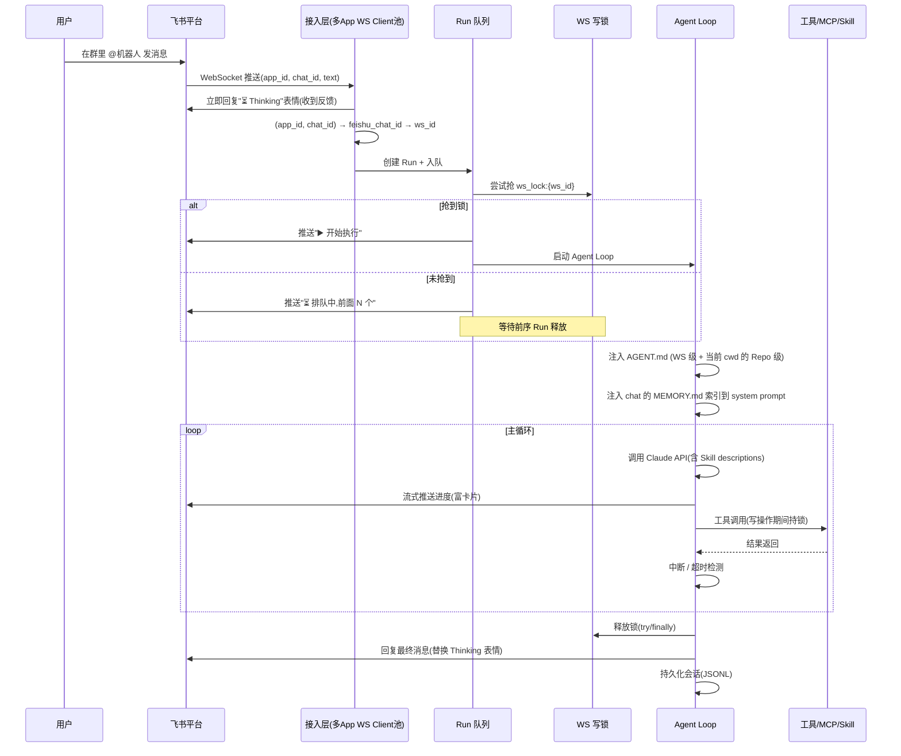

**关键说明**：

- **Thinking 表情**：接入层收到消息**立即**回复飞书"思考中"表情 / 卡片，给用户即时感知，避免 Agent 启动延迟期间用户以为消息丢失
- **路由键**：`(app_id, chat_id)` → `feishu_chat_id` → `ws_id` 三级查找
- **多 App 并行**：接入层维护多个飞书 WebSocket 长连接（每个 `app_id` 一个），消息统一进 Run 队列
- **消息去重**（D38）：以飞书 `message_id` 为幂等键写入 Redis，重连补推的重复消息在进 Run 队列前丢弃，避免重复触发 Run
- **输入边界**（MVP）：支持**纯文本**消息与**引用回复**触发 Agent；图片 / 文件 / 语音等富消息暂不处理（静默忽略或回复"暂不支持该消息类型"）。引用回复处理详见 D39
- **流式推送节流**：飞书卡片更新有 QPS 限制，`text_delta` 累计达阈值（默认 ~500ms 窗口 或 ~200 token）才合并更新一次进度卡片，避免限流；最终回复完整落盘 session JSONL
- **写锁调度**：详见 §6.6

### 6.2 工作空间创建流程

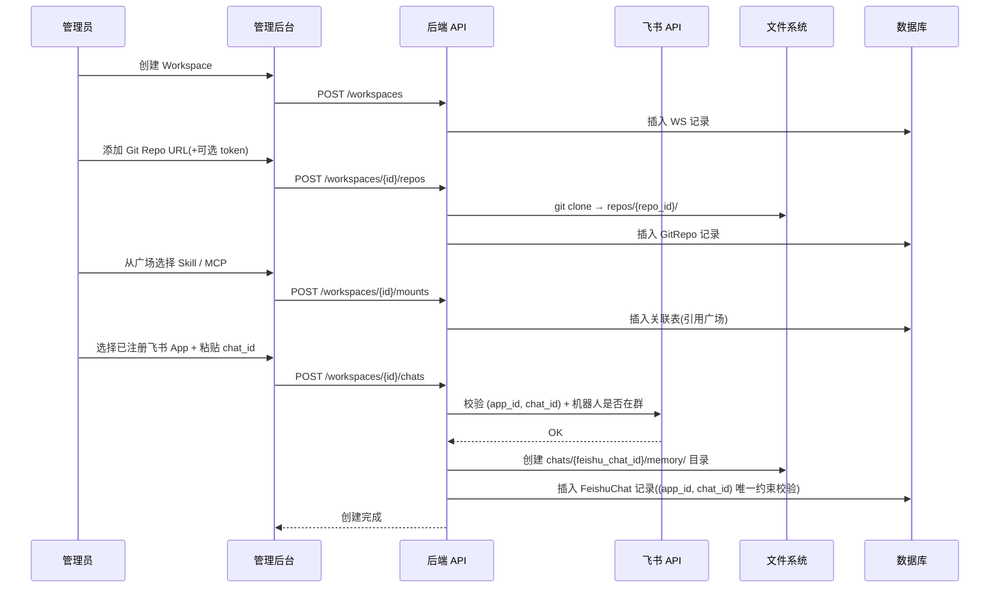

**关键说明**：

- 管理员先在"飞书 App 注册"页面录入飞书自建应用（`app_id` + `app_secret`），后续绑定时下拉选择
- 同一群挂多 WS 时，管理员重复操作：选不同 App + 同一 chat_id，每次生成独立 FeishuChat

### 6.3 Skill / MCP 动态挂载流程

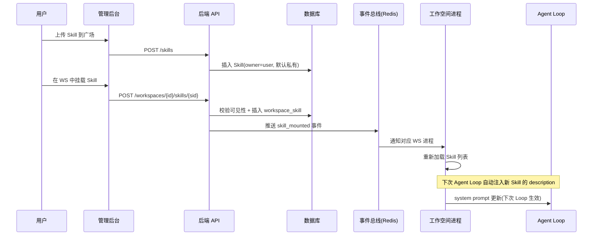

### 6.4 Memory 写入与读取流程

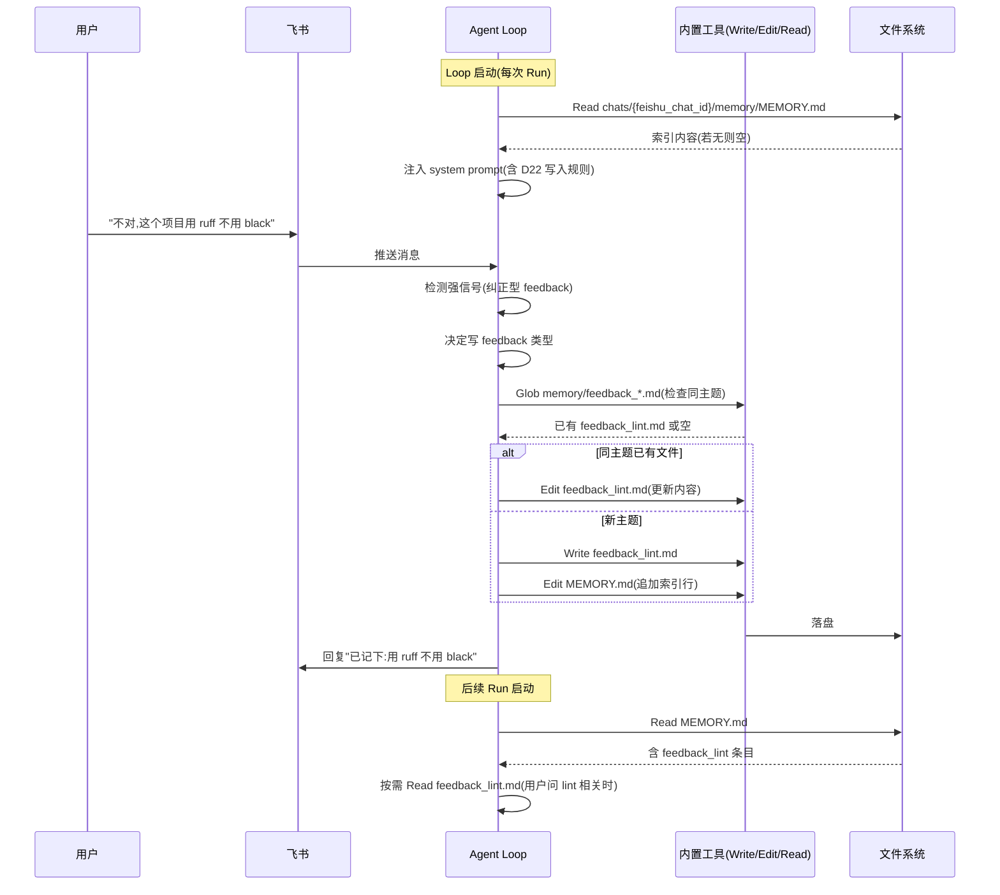

**关键点**：

- **每次 Run 都重新加载索引**：保证最新 memory 立即生效
- **同主题合并**：写入前先 Glob 检查同类文件，避免新建 5 个 `feedback_lint*.md`
- **写入即告知**：隐式写入后必须给用户简短反馈，让用户能感知并否决

### 6.5 Agent Loop 内部结构

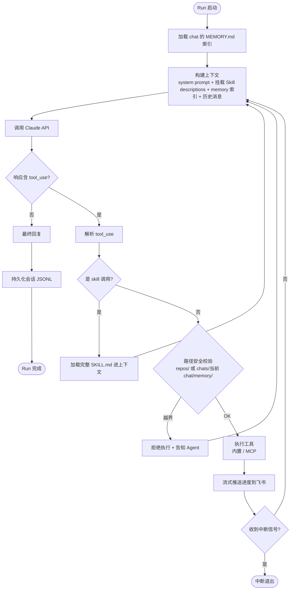

**关键说明**：

- **普通工具的一轮多并发**：单条 LLM 响应可返回多个 tool_use（Anthropic API 原生支持）。Loop 对同响应内工具按 D20 抢锁规则分组执行——只读工具（`Read` / `Glob` / `Grep` / `WebFetch` / `WebSearch` / `skill__{name}`）用 `asyncio.gather` **并发**；写工具（`Write` / `Edit` / `Bash` / 默认 MCP）**串行**。与 D33 的区别：D33 讲 `Agent` 子代理工具的并行，本条讲普通工具的并行
- **循环兜底**：除 10 min 硬超时（F3.3.6）外，设单 Run 最大 tool_use 轮数上限（默认 **50**，可配置），防 Agent 陷入"反复 Read 同一文件"式空转烧 token；触顶则中断并告知用户
- **错误回灌**（工具失败与 LLM 失败分两类处理）：
  - **工具失败**（Bash 退出码非 0、MCP 不可用、路径越界拒绝）：错误信息作为 `tool_result`（`is_error=true`）回灌 Agent，由 Agent 自主决定重试 / 换方案 / 放弃——**不一刀切中断**
  - **LLM 调用失败**（429 / 5xx / 网络超时）：Provider 层指数退避重试（默认 3 次），仍失败则中断 Run 并告知用户
- **中断检查点**：每轮 Loop 末检查中断信号（详见 §6.6）；上下文超限（D34 硬阈值）也作为中断出口

### 6.6 Run 排队与 WS 写锁生命周期

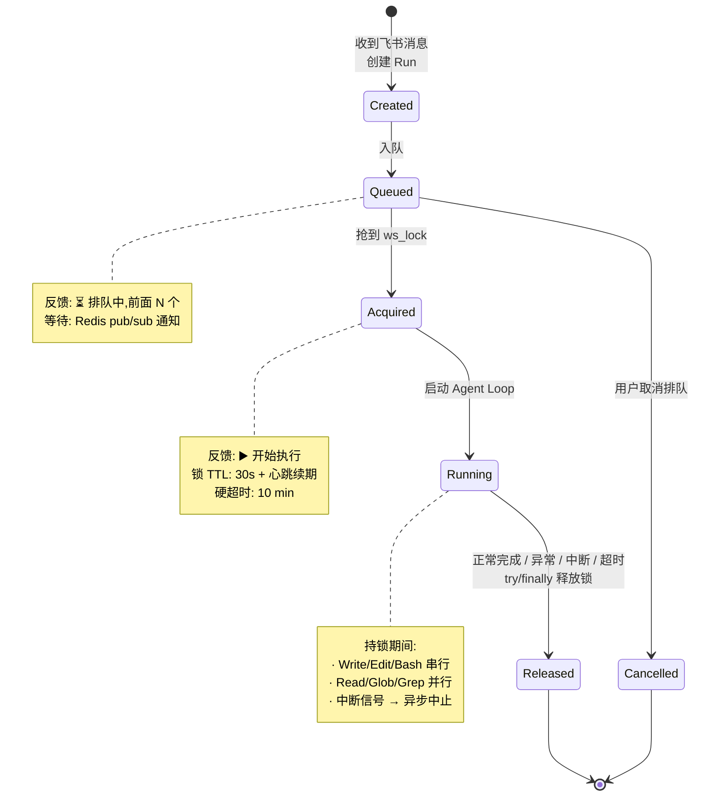

**关键设计**：

- **锁粒度**：WS 维度（多个 FeishuChat 共享一把锁），整个 Run 期间持有，非单次工具调用粒度
- **锁续期**：30s TTL + Run 跑期间心跳续期（避免长 Run 锁过期被抢占）
- **硬超时**：10 分钟兜底，防 Run 卡死导致 WS 永久死锁
- **释放保证**：`try / finally` 模式，无论正常完成 / 异常 / 中断 / 超时都释放锁
- **事件通知**：用 Redis pub/sub 通知排队中的 Run，避免空轮询

**中断执行语义**（spec F3.3.5 的细化）：

- **排队中取消**：立即从队列移除，无任何副作用、未启动 Agent Loop
- **运行中中断的执行细节**：
  - **时机**：不保证"瞬时"——当前正在执行的工具（尤其 Bash）完成或被 kill 后，Loop 才在下一轮检查点真正停止
  - **Bash**：向子进程组发 `SIGTERM`，宽限 3s 后 `SIGKILL`；其余内置工具（Read/Write/Edit 等）一般为快操作，不强制中断
  - **子代理**：中断信号级联到所有运行中子代理，子代理走同样的 `SIGTERM`/`SIGKILL`；不保证子代理的部分中间结果保留（仅最终消息才回流主 Agent）
  - **文件改动**：中断时**已落盘的改动保留，不回滚**——MVP 不做事务性回滚；用户通过 diff 预览卡片（D35）查看已改内容，自行决定保留或还原
  - **锁**：无论何种中断路径，`try / finally` 保证释放 `ws_lock`

### 6.7 Skill 加载与执行流程

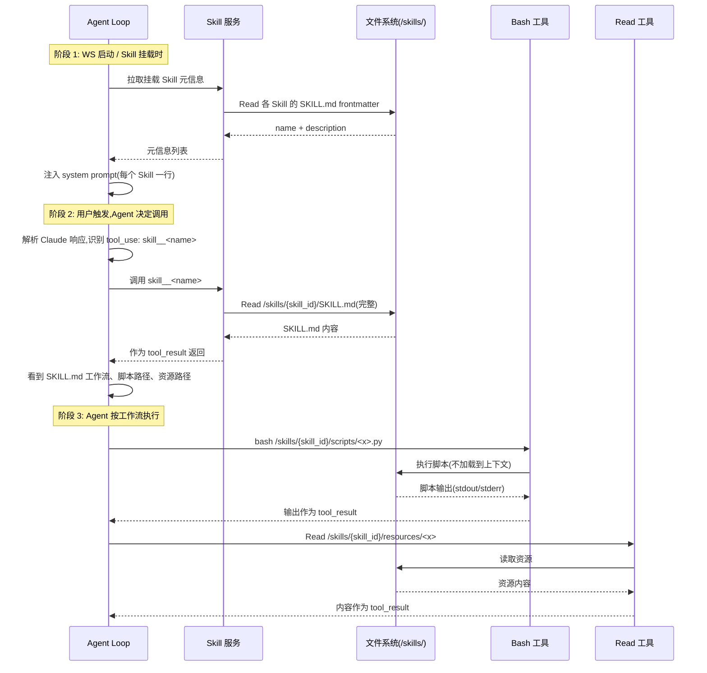

**关键点**：

- **分层加载**：元信息（必加载）→ SKILL.md（invoke 时加载）→ 脚本 / 资源（按需访问）
- **脚本不进上下文**：通过 `Bash` 执行，只把 stdout / stderr 返回；避免大量代码污染上下文
- **资源按需 Read**：模板 / 配置示例由 Agent 根据工作流读取，不预加载
- **路径约定**：所有路径在 SKILL.md 正文里写明绝对路径（`/skills/{skill_id}/...`），Agent 不需要猜测

### 6.8 Trace 采集与 span 树生成

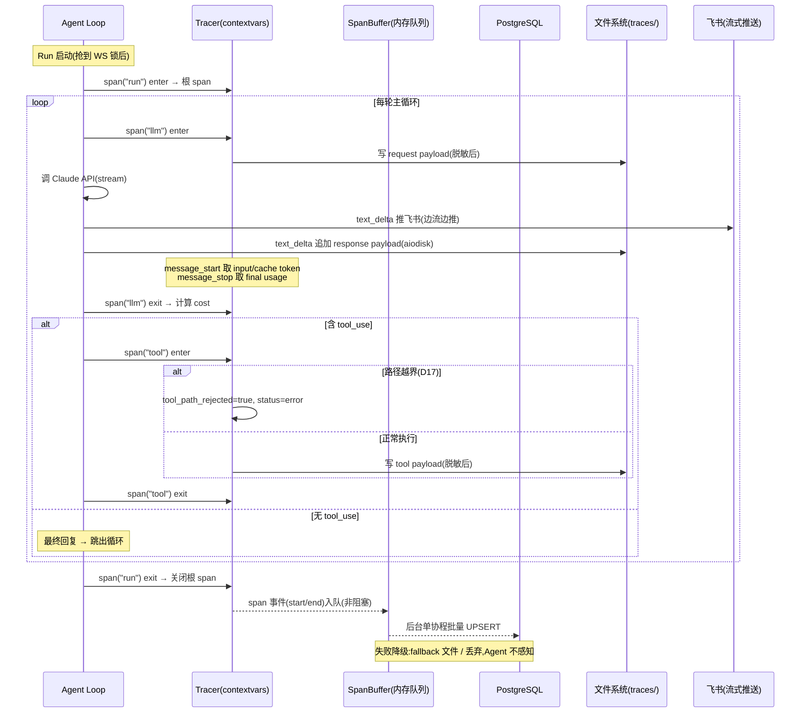

**关键点**：

- **零侵入**：Agent Loop 只调 `span()` 上下文管理器，trace_id / parent_span_id 由 contextvars 自动传递，不污染核心代码
- **边流边推边存**：Claude stream 的 text_delta 同时推飞书卡片 + 追加 payload 文件（aiodisk 不阻塞）
- **非阻塞落盘**：span 事件进内存队列后台批写，payload 走线程池，Agent 主路径永不阻塞
- **嵌套天然**：子代理 / asyncio task 自动继承父 contextvars，span 树深度不限
- **详设**：§7.3

### 6.9 并行子代理执行流程

> 决策见 D33。本节展示主 Agent 触发并行子代理的执行时序与拆分判断。

主 Agent 在一轮 LLM 响应里若返回多个 `Agent` tool_use，Loop 按 D33 拆分指导判断是否并行：只读 / 无写冲突 / 无强依赖则 `asyncio.gather` 并发，否则串行。

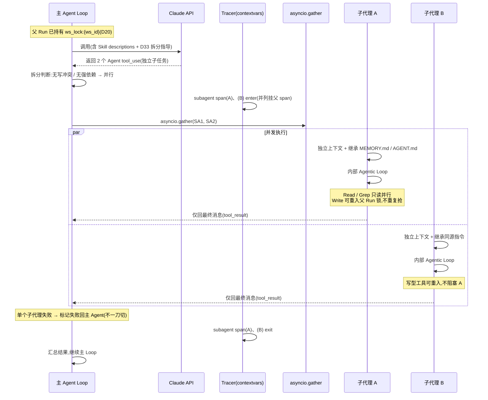

**关键点**：

- **并发而非串行**：多个 Agent tool_use 经 `asyncio.gather` 同时拉起，端到端耗时 ≈ 最慢子代理，而非之和
- **独立上下文**：子代理各自独立 system prompt + 历史，仅最终消息回流主 Agent（省 token、防上下文污染）
- **可重入锁**：父 Run 已持有 `ws_lock`，子代理复用不重复抢——只读天然并行，写型子代理间也不二次串行（依赖拆分判断避免写同一文件）
- **失败隔离**：单个子代理失败仅标记回主 Agent，由主 Agent 决定重试 / 跳过 / 终止，不拖垮整 Run
- **trace 嵌套**：各子代理一个 `subagent` span 并列挂在父 span 下，§7.2 / §6.8 天然支持

拆分判断流程（主 Agent 在发起并行前的决策路径）：

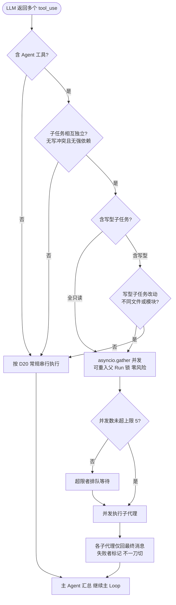

**与 D20 / D23 的衔接**：

- 并发只发生在 **Run 内**；Run 间仍由 D20 串行——父 Run 抢到 `ws_lock` 后，整个 Run（含其所有子代理）都在同一临界区内，对其他 Run 不可见
- 子代理不是独立 Run（D23 的「1 Session = 1 Run」不变），而是 Run 内的子流程；超时预算共享父 Run 的 10 min，非各自独立计时

---

## 7. 可观测性详设

> 决策摘要见 §4 D25~D31；采集流程概览见 §6.8。本节展开数据模型、采集细节、落盘降级、安全、管理后台与实施切片。
>
> **总原则**：可观测性是 best-effort——任何环节失败都不得拖垮 Agent Loop 或阻塞飞书流式推送。

### 7.1 目标与边界

**目标**：为 Agent Loop 每一步建立可追溯、可聚合、可观测的结构化轨迹，服务于：

- **调试排查**：回放 bad case，看每步决策、工具调用、上下文累积
- **成本与性能**：token 消耗、延迟分布、工具耗时、单 Run 成本
- **监控告警**：错误率 / 超时率 / 异常 Run 实时发现并推送飞书

**边界**：

| 维度 | 决策 |
|---|---|
| 存储 | 自建（PG 结构化 + 文件 payload），不引入第三方平台（D25） |
| 采集粒度 | 分层：元数据入 PG，大 payload 落文件（D26） |
| 字段标准 | 对齐 OTel `gen_ai.*` + anthropic usage，预留 OTel 导出 |
| 分析用途 | 调试 + 成本性能 + 监控告警；评测 / 模型对比暂不做（P2 预留） |

### 7.2 Trace 数据模型

**span 树**：所有执行步骤抽象为 span，组成一棵树——Run 是根 span，每次 LLM 调用 / 工具调用 / skill invoke / 子代理调用是子 span；子代理内部又会产生自己的 LLM / 工具 span，从而支持任意深度嵌套。**1 Run = 1 trace（根 span）**，与「1 Session : 1 Run」（D23）严格对应。

**单表自引用**：用一张 `spans` 表 + `parent_span_id` 自引用表达整棵树（而非 trace 头表 + observation 子表）——根 span 即 Run、字段统一便于聚合、JOIN 少。MVP 单表 + 索引不分区，未来可按 `started_at` 月度分区平滑演进。

**span 类型**：

| span_type | 含义 | 触发点 |
|---|---|---|
| run | 根 span，1 Run = 1 run span | Run 启动（抢到 WS 锁后） |
| llm | 一次 Claude API 调用 | Agent Loop 每轮调 Provider |
| tool | 一次工具调用（内置 / MCP） | 解析到 tool_use |
| skill | 一次 skill__{name} 调用（加载 SKILL.md） | Agent 触发 skill 工具 |
| subagent | 一次子代理调用，内可嵌套 | Agent 调 Agent 工具 |
| interrupt | 中断事件 | 用户中断 / 超时 |
| error | 错误标记（可选） | 异常路径 |

> `skill` 单独成类型是因为它语义介于「工具调用」与「子流程」之间（只返回 SKILL.md 文本、不抢锁、无副作用），独立后便于分析 Skill 召回质量。

**关键字段**（对齐 OTel GenAI semantic conventions + anthropic usage）：

| 字段 | 说明 |
|---|---|
| span_id / trace_id / parent_span_id / span_order | 树结构与同父排序 |
| status | running / ok / error / interrupted / timeout |
| started_at / ended_at / duration_ms | 时间与耗时 |
| provider / model / stop_reason | LLM 调用元信息 |
| input_tokens / output_tokens / cache_read_input_tokens / cache_creation_input_tokens | token 计数（对齐 anthropic usage） |
| tool_name / tool_input_summary / tool_output_summary | 工具调用摘要（摘要入库，全文落 payload 文件） |
| tool_acquired_lock / tool_path_rejected | 是否抢 WS 锁（D20）/ 是否被路径校验拒绝（D17） |
| cost_usd | 单 span 成本（llm span 必填） |
| error_type / error_message | 错误分类与摘要 |
| payload_ref / payload_size_bytes / payload_truncated | 完整 payload 文件路径与截断标记 |
| attributes | 扩展属性（预留） |

**租户边界**：每个 span 强制带 `workspace_id / feishu_chat_id / session_id / run_id` 四元外键，全部 `ON DELETE CASCADE`（WS 删除 → trace 全清，延续 NF4.1 物理隔离）。

### 7.3 采集流程

> 流程概览见 §6.8 的 sequenceDiagram。本节给出 context 传递、埋点位置与 streaming 聚合细节。

**trace context 零侵入传递**：用 Python `contextvars` 维护「当前 span_id / trace_id」，采集点以 `span()` 上下文管理器包裹、自动 enter / exit——Agent 内核代码无需显式传 trace_id。asyncio task 自动继承父上下文，因此子代理天然嵌套；异常路径自动标记 error span。

**埋点位置清单**：

| 阶段 | span 类型 | 关键字段 |
|---|---|---|
| Run 启动 / 结束 / 异常 / 中断 / 超时 | run（+ interrupt） | status, error_type, 总 cost |
| Claude API 调用前 / stream 各事件 / 调用结束 | llm | model, payload_ref, input/output/cache token, stop_reason, cost |
| tool_use 解析后 / 路径拒绝 / 抢锁 / 执行完成 | tool | tool_name, tool_input_summary, tool_path_rejected, tool_acquired_lock, duration |
| skill__{name} | skill | skill_id, 加载耗时 |
| Agent 子代理调用 | subagent | 子代理内 span 经 parent_span_id 关联到本 span |

**streaming token 聚合**（Claude stream 事件分布）：

| 事件 | 处理 |
|---|---|
| message_start | 取 input_tokens + cache_read + cache_creation，一次性赋值 |
| message_delta | 累计 output_tokens（实时显示，最终值以 message_stop 为准） |
| text_delta | 同时推飞书卡片 + 追加 response payload 文件 |
| message_stop | 取 final usage + stop_reason，覆盖最终值并计算 cost |

**边推边存**：text_delta 一边推飞书富卡片（累计到阈值合并更新，避免飞书限流），一边异步追加到 payload 文件（aiodisk 线程池，不阻塞 event loop）。

### 7.4 落盘与降级

**非阻塞落盘**：span 事件先进内存队列（put 纳秒级，绝不阻塞 Agent Loop），后台单协程批量 UPSERT 到 PG；payload 文件写交给 aiodisk 线程池；streaming token 增量先在内存 span 对象累加，仅 span 结束时落一次最终值。Run 结束前同步 flush 本 trace 的剩余 span。

**失败降级矩阵**（observability 是 best-effort，Agent 主流程永远优先）：

| 失败 | 降级行为 |
|---|---|
| 缓冲队列满 | 丢弃 span 事件，记 warning |
| PG 不可用 | 指数退避重试，仍失败则写本地 fallback 文件，下次启动重放 |
| payload 文件写失败 | 该 span payload_ref 置空 + 标 truncated，Agent 不感知 |
| tracer 抛异常 | 埋点 try/except swallow，只记本地日志 |
| 单 batch 写超时 | 放弃该 batch 转入 fallback 文件 |

### 7.5 Payload 存储与生命周期

**目录结构**（融入 §2.3 的 `chats/{feishu_chat_id}/` 子树）：

```
/workspaces/{ws_id}/chats/{feishu_chat_id}/traces/{trace_id}/
  ├── {span_id}.request.json     # LLM 请求 payload
  ├── {span_id}.response.jsonl   # LLM 流式响应（追加）
  ├── {span_id}.tool.json        # 工具输入输出
  └── {span_id}.skill.json       # skill 加载的 SKILL.md
```

**与 session JSONL 的关系**（D29）：两者并列、不混用——

| 数据 | 消费方 | 内容 | TTL |
|---|---|---|---|
| sessions/{session_id}.jsonl | Agent（下次 Run 加载上下文） | 简化 messages 数组 | 长期 |
| traces/{trace_id}/ | 人 / 聚合（调试、成本、监控） | 完整 payload + usage + cost | 30 天 |

混用会污染 Agent 上下文且格式混乱，因此独立目录、独立 TTL。

**截断策略**：

| payload 类型 | 上限 | 截断策略 |
|---|---|---|
| LLM request | 5 MB | 截 tools 数组末尾 + 最长 message content，保留 system prompt |
| LLM response | 10 MB | 停止追加后续 delta，保留 token 计数 |
| tool 输出（Bash 常见巨大） | 1 MB | stdout / stderr 各截 512 KB，中间标注截断量 |
| skill | 200 KB | SKILL.md 有长度建议（D15），一般不截断 |

**保留策略**：payload 文件默认 30 天、PG spans 默认 90 天（可配置）；每 FeishuChat 保留最近 1000 个 Run 的 payload；WS 删除时级联清理目录。

### 7.6 安全

**敏感信息脱敏**（D30，对齐 NF4.2.3）：所有 payload 落盘前在写入层统一过脱敏管线，不依赖 Agent 自觉。覆盖两类规则：

- **结构化字段名匹配**：password / api_key / secret / access_key / auth_token / bearer / private_key / client_secret 等字段名，命中即整个值替换为 `***REDACTED***`
- **正则模式匹配**：AWS Access Key、Generic API key、Bearer token、私钥块、GitHub token、Slack token、连接串密码

命中后保留字段名与结构（调试时仍能看到「此处曾有 password」），只脱敏值。规则可后台配置 + WS 级覆盖。

**多租户隔离**（D31）：trace 数据访问边界 = WS 边界。

- ORM 层用 event listener 在所有 spans 查询强制注入 `WHERE workspace_id`，杜绝忘加过滤
- API 层从用户 session 取 ws_id，不接受客户端传入（防越权）
- payload 文件读取必须先 PG 校验 run_id 归属再读，禁直接拼路径（防路径穿越）
- WS 删除时 spans CASCADE + traces/ 目录递归删除

### 7.7 管理后台

**路由**：

- `/traces`：Run 列表（按 ws / chat / status / 时间筛选）
- `/traces/:run_id`：单 Run 瀑布图（调试核心）
- `/insights/cost`：成本与性能聚合
- `/insights/tools`：工具耗时 TopN / 错误率
- `/monitoring`：异常 Run + 告警规则配置

**调试瀑布图**：横轴时间、纵轴 span 树的 Gantt 视图；选中 span 在右侧抽屉看基本信息 / token / cost / 错误，并内联展开 Request / Response / Tool I/O（大文件后端分片流式返回）；span 类型用颜色区分（llm 蓝 / tool 绿 / skill 紫 / subagent 橙 / error 红）。

**成本与性能聚合**：指标卡（总 token / 总 cost / 平均 Run 耗时 / P95）+ 图表（每日 cost 趋势、token 分布、模型占比、工具耗时 TopN、单 Run 成本 TopN）；大跨度走物化视图，小跨度实时聚合，支持钻取到 Run。

**监控告警**：异常 Run 列表（error / timeout / interrupted）+ 可配置规则。默认规则：

| 规则 | 阈值 | 窗口 | 通知 |
|---|---|---|---|
| 高错误率 | > 10% | 1h | 飞书群 |
| 高超时率 | > 5% | 1h | 飞书群 |
| Run 延迟异常 | P95 > 5min | 1h | 飞书群 |
| 单 Run 成本异常 | > $1 | 单 Run | 飞书群（实时） |
| WS 日成本上限 | > $50 | 24h | 飞书群 + 后台 |

后台定时任务（每 1 min 扫规则），命中后通过接入层推飞书卡片。

### 7.8 实施切片

| 阶段 | 范围 | 对应需求 |
|---|---|---|
| **P0** 最小可用（调试单 Run） | spans 表 + ORM + WS 隔离 listener；tracer + contextvars；SpanBuffer 批写 + fallback；Agent Loop 埋点（Run / LLM stream / Tool / Skill / 错误中断）；payload 写入 + 截断；脱敏管线；后台 Trace 列表 + 瀑布图（只读）+ payload 读取 API | F3.10.1~5 / NF4.6.1~4 |
| **P1** 成本 / 监控 | cost 计算引擎（pricing 表 + cache 折算）；daily_run_stats 物化视图；成本聚合视图；监控视图；告警规则表 + 定时扫描 + 飞书通知；TTL 清理 | F3.10.6~7 |
| **P2** 预留扩展 | OTel 导出；质量评估（eval_runs 关联）；模型对比；Trace 采样 | NF4.6.6 |

---

## 8. 管理后台接口设计

> 完整接口清单见 [api.md](./api.md)。本节给出概览与通用约定。

管理后台（Vue 3，M5）与后端（FastAPI）通过 RESTful HTTP 交互。飞书侧的 WebSocket 推送与富卡片不走本接口，由接入层独立承担。

**接口域概览**：

| 域 | 主要资源 | 典型路径 |
|---|---|---|
| 鉴权 | 账号密码 | /api/auth/login、/me |
| 飞书 App | 自建应用凭证 | /feishu-apps |
| 工作空间 | WS | /workspaces |
| WS 内资源 | Repo / FeishuChat / 挂载 / AGENT.md | /workspaces/{ws_id}/repos、/chats、/skills、/agent-md |
| 广场 | Skill / MCP | /skills、/mcps |
| 会话历史 | Session | /workspaces/{ws_id}/sessions |
| Memory | chat 级记忆文件 | /workspaces/{ws_id}/chats/{feishu_chat_id}/memory |
| 可观测性 | Trace / Insights / Monitoring | /workspaces/{ws_id}/traces、/insights、/monitoring |

**通用约定**（详见 api.md §1）：

- **鉴权**：自建账号密码 + HttpOnly Cookie session（D32）
- **多租户**：ws_id 一律放路径（`/workspaces/{ws_id}/...`），后端校验当前用户对该 WS 的权限；写操作与 trace 查询需 owner 校验（F3.8.2 / D31）
- **统一响应**：成功返回资源（200 / 201 / 204），错误返回 4xx/5xx + `{ error: { code, message } }`
- **分页**：`?page=&page_size=`，响应含 `items / total / page / page_size`
- **异步任务**：长操作（git clone、WS 级联删除）返回 202 + task_id，轮询 `/tasks/{task_id}`
- **敏感字段保护**：飞书 app_secret 列表 / 详情脱敏（仅创建时返回一次）；memory 文件名严格白名单防穿越（D17）

接口细节（请求 / 响应、错误码、关键接口示例）见 [api.md](./api.md)。

---

## 9. 开发里程碑（建议）

| 周 | 里程碑 | 关键产出 |
|---|---|---|
| Week 1-2 | 基础架构 | 多 App 飞书 WebSocket 接入、工作空间模型、Git clone、基础 Agent Loop、Thinking 反馈 |
| Week 3-4 | 核心闭环 | 内置工具、飞书富卡片（含排队）、Session/Run 管理、FeishuChat 级目录隔离、WS 写锁 |
| Week 5-6 | 后台 + 高级特性 | Vue 后台、**管理后台 API（[api.md](./api.md)）**、Skill / MCP 动态管理、Memory 系统、**可观测性 P0**（spans 表 + 采集埋点 + Trace 瀑布图） |
| Week 7+ | 测试 + 部署 | 端到端测试、账号开通上线、**可观测性 P1**（成本聚合 + 监控告警） |
