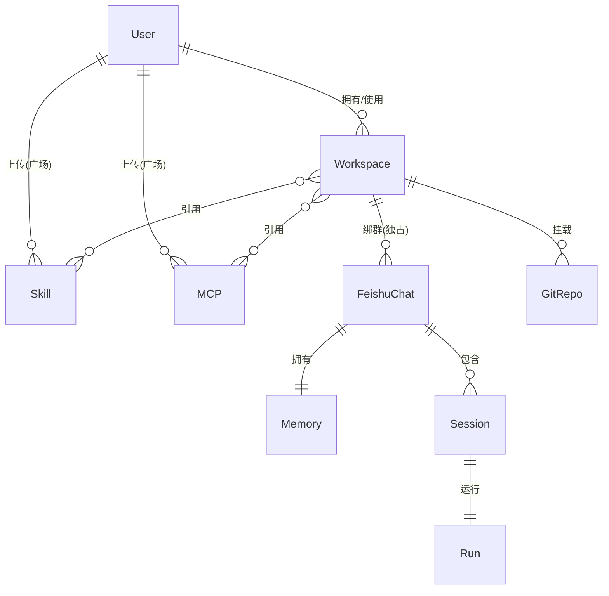
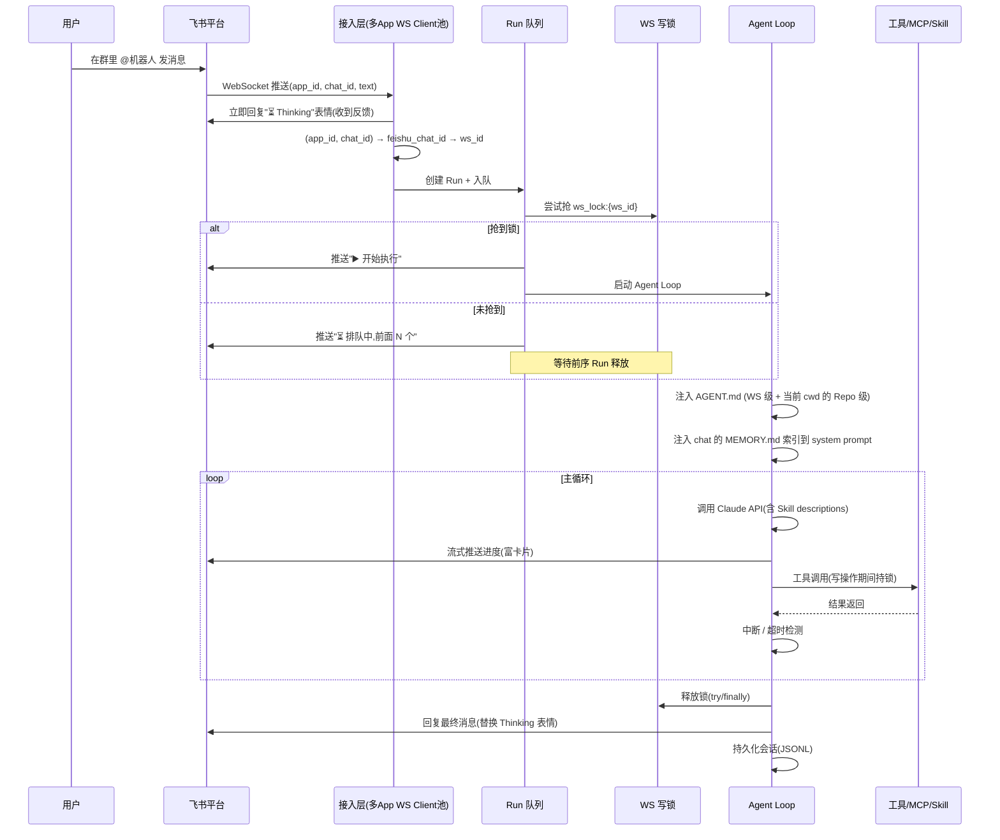
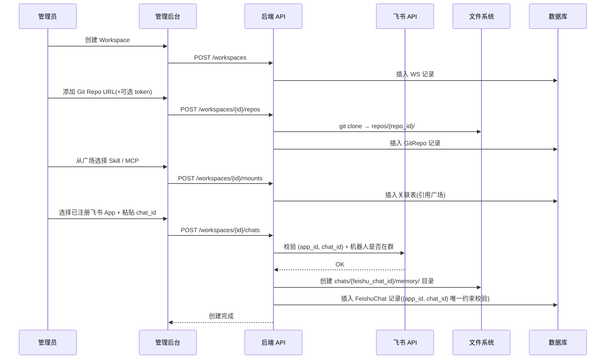
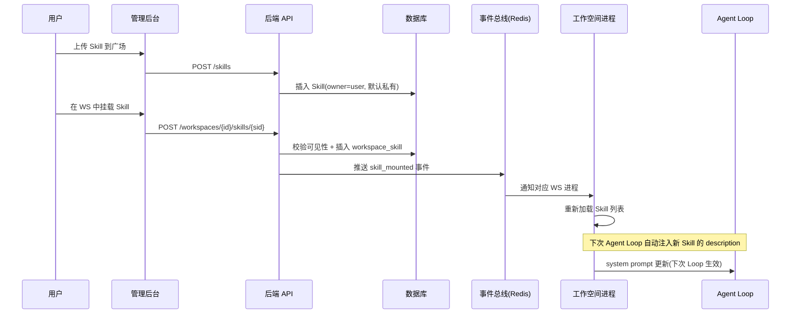
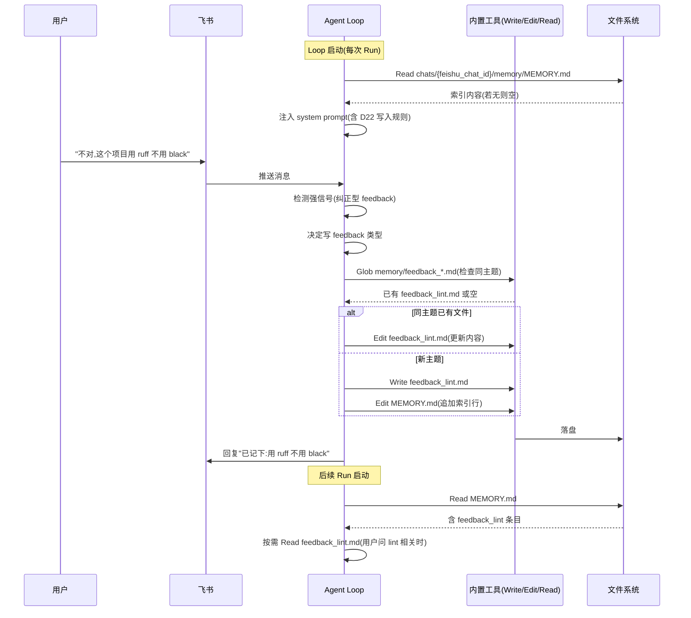
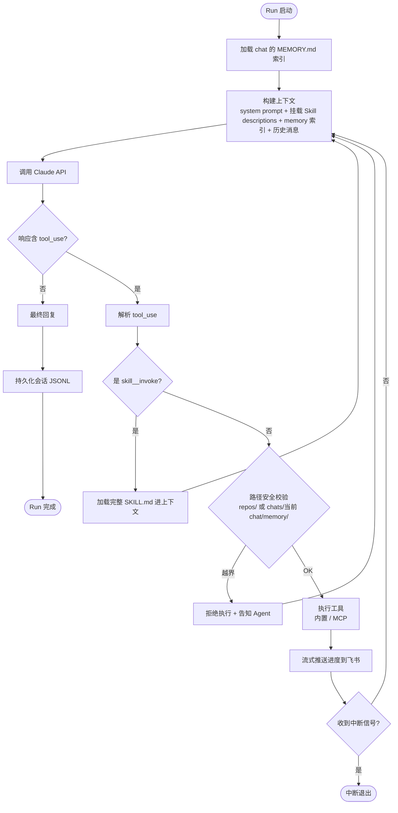
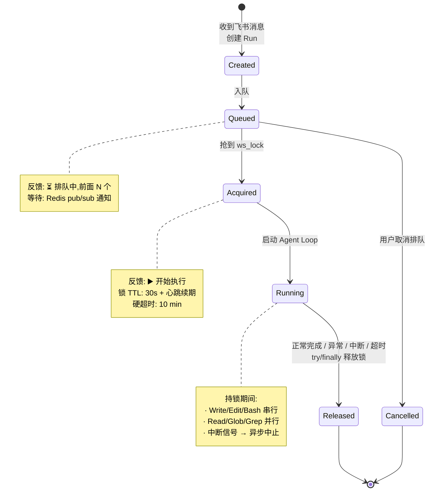
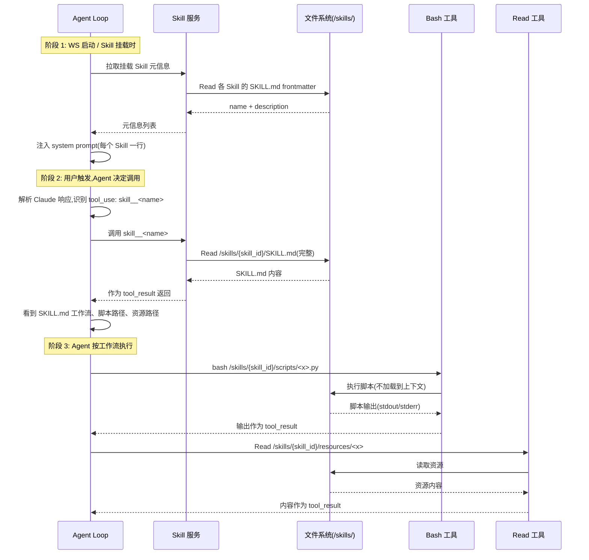

# Code Forge - 设计文档

> 本文档记录 Code Forge 的设计思路、技术选型、关键决策、流程图。需求规格见 [spec.md](./spec.md)。

---

## 1. 整体架构

```
                  ┌──────────────────────────────┐
                  │  飞书客户端 (移动 / 桌面)      │
                  └───────────────┬──────────────┘
                                  │ WebSocket (长连接)
                                  ▼
                  ┌──────────────────────────────┐
                  │  飞书开放平台                   │
                  └───────────────┬──────────────┘
                                  │
                ┌─────────────────┴─────────────────┐
                ▼                                   ▼
  ┌──────────────────────────────┐    ┌────────────────────────┐
  │  Code Forge 后端 (FastAPI)    │    │  管理后台 (Vue 3)       │
  │  ┌──────────────────────────┐ │    │  - Workspace CRUD      │
  │  │ 接入层: 多App飞书WS Client│ │    │  - Skill/MCP 广场      │
  │  ├──────────────────────────┤ │    │  - 会话历史 / 配置      │
  │  │ 路由层: app_id+chat_id→ws│ │    │  - Memory 管理         │
  │  ├──────────────────────────┤ │    └────────────────────────┘
  │  │ 业务层: WS/Session/Run   │ │
  │  ├──────────────────────────┤ │
  │  │ Agent 内核: Loop + 流式   │ │
  │  ├──────────────────────────┤ │
  │  │ 工具层: 内置 / MCP / Skill│ │
  │  └──────────────────────────┘ │
  └──────────────────────────────┘
      │              │              │
      ▼              ▼              ▼
  ┌────────┐   ┌─────────┐   ┌────────────────────────┐
  │Postgre │   │ Redis   │   │ 文件系统                │
  │元数据/ │   │任务队列/│   │ /workspaces/{ws_id}/   │
  │会话/配置│   │事件总线/│   │ /skills/{skill_id}/   │
  │        │   │缓存     │   │   (全局广场)            │
  └────────┘   └─────────┘   └────────────────────────┘
                                       │
                                       ▼
                            ┌────────────────────────┐
                            │ 外部 MCP 服务           │
                            │ (stdio / http)         │
                            └────────────────────────┘
```

---

## 2. 核心概念

### 2.1 实体关系



**关系多重性说明**：

| 关系 | 左 → 右 | 右 → 左 | 业务语义 |
|---|---|---|---|
| User ↔ Workspace | 1 → N | N → 1 | 1 用户拥有 / 使用 N 个 WS；1 WS 归属 1 用户 |
| User ↔ Skill | 1 → N | N → 1 | 1 用户可上传 N 个 Skill；1 Skill 归属 1 owner |
| User ↔ MCP | 1 → N | N → 1 | 同上 |
| **Workspace ↔ FeishuChat** | **1 → N** | **1 → 1（独占）** | **1 WS 可绑多个 FeishuChat；1 FeishuChat 只能绑 1 WS** |
| Workspace ↔ GitRepo | 1 → N | N → 1 | 1 WS 可挂多个 repo；1 repo 归属 1 WS |
| Workspace ↔ Skill | N ↔ N | — | 多对多，通过 `workspace_skill` 关联表 |
| Workspace ↔ MCP | N ↔ N | — | 同上 |
| FeishuChat ↔ Memory | 1 → 1 | 1 → 1 | 1 chat 对应 1 份 memory 目录 |
| FeishuChat ↔ Session | 1 → N | N → 1 | 1 chat 可有多次会话（1 session = 1 run） |
| Session ↔ Run | 1 → 1 | 1 → 1 | 1 session 对应 1 run |

**关键约束**：

- **chat 独占 WS**：1 个 FeishuChat 实体（由 `app_id + chat_id` 唯一确定）只能绑 1 个 WS。同一项目可以绑多个群（开发群 / 测试群 / ...），但反过来不允许同一 FeishuChat 挂多个 WS
- **多机器人一群**：1 个飞书群可以通过加多个机器人（多个 `app_id`）实现"绑多 WS"——每个 `(app_id, chat_id)` 对是一个独立 FeishuChat，各自绑一个 WS
- **Memory 隶属 chat**：1 FeishuChat 1 份 memory 目录，跨 session 持久，跨 FeishuChat 隔离
- **Skill / MCP 是顶层实体**：存于全局广场，WS 通过关联表 N:N 引用

### 2.2 概念定义

| 概念 | 定义 | 形态 |
|---|---|---|
| **Workspace** | 物理实体，独立隔离单元 | 文件目录 + DB 记录 |
| **FeishuChat** | WS 的逻辑接入点，唯一键 `(app_id, chat_id)`；仅群聊；FeishuChat 独占 WS 不共享 | DB 记录 |
| **GitRepo** | 项目代码仓库，1 WS 可绑多个（用户自选数量） | 文件目录（git clone）+ DB 记录 |
| **Skill** | 一个目录（SKILL.md + resources + 可选脚本），存于全局广场 | 文件目录（全局） |
| **MCP** | 外部工具服务（stdio / http），存于全局广场 | DB 配置（全局）+ 客户端连接 |
| **Memory** | Chat 级长期记忆，跨 session 持久 | 文件目录（`chats/{feishu_chat_id}/memory/`） |
| **Session** | 上下文单元，独立的对话历史；1 session = 1 run | DB 记录 + JSONL |
| **Run** | 一次 Agent Loop 实例（用户发一条消息触发 Agent 跑一轮） | DB 记录 + 异步任务 |

### 2.3 工作空间目录结构

```
/workspaces/{ws_id}/                # 物理工作空间
  ├── workspace.toml                # 配置(引用 repos/skills/mcps/chats)
  ├── AGENT.md                      # WS 级项目指令(详见 D24,Run 启动时注入)
  ├── repos/                        # 多 repo 根目录(Agent 默认 cwd)
  │   └── {repo_id}/                # 每个 repo 一个子目录
  │       ├── .git/
  │       ├── AGENT.md              # Repo 级项目指令(随 git 同步,详见 D24)
  │       └── <文件>
  ├── chats/{feishu_chat_id}/       # FeishuChat 内部ID((app_id,chat_id) 唯一)
  │   ├── memory/                   # Memory 目录(跨 session 持久)
  │   │   ├── MEMORY.md             # 索引(Agent Loop 启动时注入)
  │   │   ├── user_*.md             # 角色与偏好
  │   │   ├── feedback_*.md         # 反馈与纠正
  │   │   ├── project_*.md          # 项目动态
  │   │   └── reference_*.md        # 外部系统指针
  │   └── sessions/                 # 会话历史(JSONL)
  │       └── {session_id}.jsonl
  └── logs/

/skills/{skill_id}/                 # 全局广场(跨 WS 共享)
  ├── SKILL.md
  ├── resources/
  └── scripts/
```

**说明**：

- `repos/` 是工具调用允许访问的唯一代码子树（详见 D17）
- `AGENT.md` 是 WS 级与 Repo 级项目指令文件，由后端在 Run 启动时直接读取并注入 system prompt（不走工具调用，详见 D24）
- `chats/{feishu_chat_id}/` 隔离不同 FeishuChat 的 memory 与 session，互相不可访问；同一飞书群在多机器人场景下会有多个 feishu_chat_id（每个 `app_id` 一个）
- 全局广场 `/skills/` 与 WS 平级，WS 通过挂载引用

---

## 3. 技术选型

### 3.1 后端

| 组件 | 选型 | 说明 |
|---|---|---|
| 语言 | Python 3.11+ | 异步生态成熟，LLM SDK 一等支持 |
| Web 框架 | FastAPI | 原生异步、OpenAPI 自动生成 |
| LLM SDK | anthropic SDK | MVP 先支持 Claude，抽象 Provider 层 |
| 飞书 SDK | lark-oapi | 官方 Python SDK，支持 WebSocket 模式 |
| ORM | SQLAlchemy 2.x | 异步支持完善 |
| Migration | Alembic | SQLAlchemy 配套 |
| 异步任务 | asyncio + Redis 队列 | MVP 不引入 Celery，简化部署 |

### 3.2 前端（管理后台）

| 组件 | 选型 |
|---|---|
| 框架 | Vue 3 (Composition API) |
| UI 库 | Element Plus |
| 状态管理 | Pinia |
| 路由 | Vue Router |
| 构建 | Vite |

### 3.3 存储

| 类型 | 选型 | 用途 |
|---|---|---|
| 关系数据库 | PostgreSQL | 元数据、会话、配置 |
| 缓存 / 队列 | Redis | 任务状态、消息队列、事件总线 |
| 文件系统 | 本地磁盘 | 工作空间目录、全局广场 |

### 3.4 部署

| 阶段 | 方案 |
|---|---|
| MVP | Docker Compose |
| 生产 | K8s |

---

## 4. 关键决策记录

### D1: 部署形态 = 云端 Web 服务

- **理由**：支持 7x24 在线、移动端访问、多设备同步
- **权衡**：开发成本高于本地 CLI，但适配飞书移动场景

### D2: 使用范围 = 对外服务（多租户）

- **理由**：长期目标是对外服务，架构需要早期预留
- **MVP 策略**：先做 "准多租户" 版本（架构预留，邀请制使用），暂不做完整计费 / 审计

### D3: LLM 选型 = 多模型可切换

- **理由**：避免厂商锁定，灵活适配不同场景
- **MVP 策略**：先 Claude（生态最匹配 Tool Use），抽象 Provider 层为后续多模型铺路

### D4: 飞书交互深度 = 文本 + 富卡片

- **理由**：Coding 任务需要 diff 预览、确认按钮等富交互
- **关键卡片类型**：diff 预览、Plan 确认、进度反馈、TaskList

### D5: 代码执行 = 不用沙箱，工作空间作为软隔离

- **理由**：简化 MVP，用户自己把控风险
- **隔离方式**：路径前缀校验，工作空间之间互不可见
- **不提供**：CPU / 内存 / 网络限制

### D6: 项目代码来源 = 多 Repo + HTTPS clone（无 OAuth）

- **关系**：1 WS : N GitRepo，用户自选数量（0~N）
- **理由**：简化认证流程；多 repo 支持微服务 / 前后端等场景
- **支持**：可选 token 用于私有仓库
- **Agent cwd**：默认在 `repos/` 根，工具调用显式带 repo_id 路径前缀
- **跨 repo 操作**：MVP 不支持，Agent 在单 repo 内活动

### D7: 飞书应用 = 企业自建应用，支持多 App 配置

- **理由**：最灵活，无需审核
- **场景**：每个企业独立安装
- **多 App 支持**：后端维护一张 `feishu_app` 表（`app_id` + `app_secret` + owner），每个 App 对应一个飞书自建应用（一个机器人）
- **接入层**：每个 App 启动一个独立的飞书 WebSocket 长连接（多 Client 池），共享同一接入层调度
- **理由**：实现"同一群挂多 WS"必须有多 App 支持（详见 D8 多机器人一群）

### D8: Workspace 与 FeishuChat 关系 = 1:N，FeishuChat 独占

- **模型**：WS（物理）→ FeishuChat（逻辑接入点）；1 WS 可绑 N 个 FeishuChat（开发群 / 测试群 / ...）
- **FeishuChat 唯一键**：`(app_id, chat_id)` 联合唯一（一个机器人 + 一个群 = 一个 FeishuChat）
- **独占约束**：1 个 FeishuChat 只能绑 1 个 WS，不允许跨 WS 共享
- **多机器人一群**：用户可以通过"在同一个群里加多个机器人（多个 `app_id`）"实现"一群挂多 WS"——每个 `(app_id, chat_id)` 对是一个独立 FeishuChat，各自绑不同的 WS。从 Code Forge 视角看，仍是 1 FeishuChat : 1 WS
- **聊天类型**：MVP 仅支持群聊，私聊暂不做
- **绑定输入**：管理员在后台选择已注册的飞书 App + 粘贴 chat_id，后端校验合法性 + 机器人是否在群
- **理由**：1:N 让同一工作空间接入多个团队场景；FeishuChat 独占避免路由歧义；多机器人机制让"一群多 WS"在物理层成立而模型层不变

### D9: 后端语言 = Python

- **理由**：anthropic SDK 一等支持，异步处理方便，生态成熟

### D10: 工作空间管理 = Web 管理后台

- **理由**：交互体验优于纯飞书命令

### D11: MCP / Skill = 全局广场 + 用户上传 + WS 引用挂载

- **广场**：Skill / MCP 是顶层实体，存在全局目录（`/skills/`、DB 中的 MCP 表），跨 WS 共享
- **上传**：用户可上传（无需审核，立即可用）；owner 才能编辑 / 删除
- **挂载**：WS 通过关联表引用广场资源，N:N 关系
- **删除策略**：被引用时禁删，必须先解绑所有 WS
- **可见性**：默认 owner 私有，可设"全员可见"开关
- **理由**：避免重复存储；用户驱动的生态而非管理员审核

### D12: 后台技术栈 = Vue 3 + Element Plus

- **理由**：团队熟悉 Vue 生态

### D13: 聊天场景 = 群聊为主（MVP）

- **挑战**：群聊需要处理多用户权限、@识别（详见 D21）

### D14: Run 调度 = 同 WS 多 Run 共存（写串行）

- **挑战**：并行 Run 改同一份代码会冲突，详见 D20
- **方案**：WS 写锁串行 + Run 队列反馈（详见 D20 + §6.6）

### D15: Skill 形态 = 一个目录

- **理由**：跟 Claude Code 一致，表达力强
- **目录结构**：

  ```
  /skills/{skill_id}/
    ├── SKILL.md          # 主入口（必需）
    ├── resources/        # 资源文件（模板 / 配置示例 / 参考文档，可选）
    └── scripts/          # 可执行脚本（可选）
  ```

- **SKILL.md 标准结构**：

  ````markdown
  ---
  name: <skill_name>           # 必需，全局唯一（在 WS 内）
  description: <一句话描述>     # 必需，注入 system prompt，决定模型是否调用
  ---

  # <Skill 名称>

  ## 何时使用
  <触发场景描述>

  ## 工作流程
  1. <步骤 1，含脚本调用 / 资源读取路径>
  2. <步骤 2>

  ## 脚本说明（如有）
  - `scripts/<name>.py`：<用途>

  ## 注意事项
  <约束 / 边界条件>
  ````

- **frontmatter 字段**：
  - `name`：Skill 标识，全局唯一（在 WS 挂载范围内）
  - `description`：一句话，注入 system prompt（必须精炼，决定召回率）
- **正文约定**：
  - 必须明确告知 Agent 脚本调用路径（绝对路径 `/skills/{skill_id}/scripts/...`）
  - 必须明确告知 Agent 资源读取路径（`/skills/{skill_id}/resources/...`）
  - 不写脚本源码（脚本独立放在 `scripts/`）

### D16: Skill 加载策略 = 按需 invoke（3 阶段渐进式）

**核心思路**：把 Skill 的元信息 / 完整内容 / 执行依赖分层加载，避免 system prompt 膨胀。

#### 阶段 1：System Prompt 元信息注入（启动时）

- **何时加载**：WS 启动 / Skill 挂载 / 解绑时
- **加载内容**：仅 frontmatter 的 `name + description`，每个 Skill 一行
- **注入位置**：system prompt
- **示例**：

  ```
  可用的 Skills:
  - python-test: 生成 Python 单元测试
  - code-review: 代码审查，检查常见问题
  ```

- **挂载数量上限**：单 WS 最多 50 个 Skill（约 5K token）

#### 阶段 2：完整 SKILL.md 加载（Agent invoke 时）

- **何时加载**：模型基于 description 判断需要调用 → 触发 `skill__{name}` 工具
- **加载内容**：完整 `SKILL.md`（含 frontmatter + 正文）
- **加载方式**：后端读取 `/skills/{skill_id}/SKILL.md` → 作为 `tool_result` 返回
- **效果**：Agent 看到完整工作流程、脚本路径、资源路径

#### 阶段 3：脚本 / 资源按需访问（Agent 自主驱动）

| 类型 | 访问方式 | 说明 |
|---|---|---|
| `scripts/*.py` / `*.sh` | Agent 调用 `Bash` 执行 | 脚本不进入上下文，只执行；输出通过 `tool_result` 返回 |
| `resources/*` | Agent 调用 `Read` 读取 | 模板 / 配置示例按需读取，不预加载 |

**关键设计**：
- 脚本是"被执行的"，不是"被加载的"
- 资源是"被按需读取的"，不是"被预加载的"
- 所有路径都在 SKILL.md 正文里告知 Agent

#### 加载示例

```
WS-Frontend 挂载 python-test Skill

1. WS 启动 → 注入 system prompt
   "python-test: 生成 Python 单元测试"

2. 用户："给 login.py 写测试"

3. Agent 决定调用 → tool_use: skill__python-test

4. 后端 Read /skills/python-test/SKILL.md → 返回 tool_result

5. Agent 看到 SKILL.md 工作流，按步骤执行：
   - Bash: bash /skills/python-test/scripts/analyze.py login.py
   - Read: /skills/python-test/resources/test_template.py
   - Write: login_test.py
```

#### 长期演进：二阶段召回

- 超过 50 个 Skill 时，用 embedding 召回 top-K 注入 system prompt
- MVP 不做

### D17: WS 内路径安全 = 工具调用强制限定在 repos/ 子树

- **校验**：所有工具调用的路径必须 resolve 后落在 `/workspaces/{ws_id}/repos/` 子树下
- **禁止**：越界访问其他 WS、系统目录、`/skills/` 全局广场、`chats/` 子树
- **理由**：D5 决定不用沙箱，路径校验作为软隔离手段

### D18: Memory 作用域 = FeishuChat 级（跨 session 持久，跨 FeishuChat 隔离）

- **作用域**：Memory 以 FeishuChat 为隔离单元
- **目录**：`/workspaces/{ws_id}/chats/{feishu_chat_id}/memory/`
- **理由**：
  - FeishuChat 是飞书的逻辑接入点，1 WS : N FeishuChat（D8），不同 FeishuChat 场景差异大（开发群 vs 测试群）
  - FeishuChat 级隔离天然避免群聊多用户归属问题
  - 跨 session 持久让 Agent 在同一 FeishuChat 内能记住历史决策与用户偏好
- **群聊场景**：同一 FeishuChat 内多用户共享 memory（A 说的偏好，B 触发时 Agent 也会用）

### D19: Memory 写入方式 = 复用内置 Write / Edit（不提供专门 memory 工具）

- **方式**：Agent 通过内置 Write / Edit 直接落盘到 `chats/{feishu_chat_id}/memory/`
- **加载**：Agent Loop 启动时自动把 `MEMORY.md` 索引注入 system prompt（具体文件按需 Read）
- **理由**：跟 Claude Code 一致，工具集合更精简，Agent 学习成本低
- **后台管理**：管理员在管理后台编辑 / 删除 memory 文件（按 FeishuChat 维度组织）

### D20: WS 写锁 = 工作空间级串行写操作

- **背景**：1 WS 可绑 N FeishuChat（D8），多 FeishuChat 触发的 Run 共享同一 `repos/` 子树，并行修改会冲突覆盖
- **方案**：工作空间级写锁 + Run 排队
- **锁实现**：Redis 分布式锁 `ws_lock:{ws_id}`
- **抢锁范围**：

  | 工具 | 是否抢锁 | 说明 |
  |---|---|---|
  | `Write` / `Edit` | ✅ | 直接写文件 |
  | `Bash` | ✅ | 无法静态判断读 / 写（`ls`、`ls && rm` 难区分），无脑全抢 |
  | `Read` / `Glob` / `Grep` | ❌ | 只读，并行安全 |
  | `skill__{name}` | ❌ | 仅加载内容到上下文 |
  | `WebFetch` / `WebSearch` | ❌ | 网络访问 |
  | `TaskList` 系列 | ❌ | Agent 内部 todos，无副作用 |
  | `Agent`（子代理） | 看子任务 | 子代理调用上述工具时按规则判断 |

- **生命周期**：
  - 入队：Run 创建后入队，尝试抢锁；抢不到则等待
  - 持有：抢到锁后整个 Run 期间持有（不是单次工具调用粒度）
  - 释放：`try / finally` 保证异常 / 中断 / 超时都释放
- **超时**：硬上限 10 分钟（兜底防死锁；正常 Run < 5 min）
- **中断**：
  - 排队中可取消：用户点飞书"取消排队"按钮，从队列移除
  - 运行中可中断：信号传到 Agent Loop，异步中止 + 释放锁
- **反馈**：
  - ⏳ 入队时推送"排队中，前面 N 个"
  - ▶️ 抢到锁时推送"开始执行"
- **理由**：MVP 简单粗暴；真实场景下同一 WS 并行触发概率不高，串行体验可接受；后续如成瓶颈可演进到 repo 级锁或 git worktree

### D21: 群聊权限 = 无权限模型（拉群即用）

- **规则**：飞书群成员资格 = Agent 使用权；任何人 @ 机器人都能触发 Run
- **不做的事**：
  - 不做角色区分（不区分管理员 / 参与者）
  - 不做用户级权限校验
  - 不做飞书 chat 内的功能限制
- **控制权移交飞书原生**：谁能拉机器人 / 拉人进群，由飞书群管理员设置控制
- **保留的管理后台权限**：WS 配置 / Skill 上传 / Memory 管理等仍需 owner 校验（spec F3.8.2），与飞书群内使用权是两层
- **理由**：
  - 简化 MVP，避免权限模型膨胀
  - 跟 IM 工具使用习惯一致（拉群即共享）
  - 真正的权限边界是 WS 物理隔离（路径校验，详见 D17），不是用户级

### D22: Memory 写入策略 = Agent 自主判断 + 强信号触发

- **核心机制**：Agent 自主判断对话中的重要信息，主动写入 memory；用户不需要显式说"记住 X"
- **强信号触发条件**（任一满足即写入）：

  | 类型 | 触发条件 | 示例 |
  |---|---|---|
  | **显式指令** | 用户说"记住 X" / "记一下" / "别忘了" | "记住我们用 ruff 不用 black" |
  | **纠正型 feedback** | 用户说"不对" / "错了" / "应该是 X 不是 Y" | Agent 用 black，用户说"不对，用 ruff" |
  | **重复偏好** | 同类偏好出现 ≥ 2 次 | 用户连续 3 次要求加 type hints |
  | **强烈情绪** | 用户说"千万别" / "求你别" / "一定要" | "求你别再用 print 调试" |
  | **主动告知** | 用户介绍自己 / 项目 / 外部系统 | "我是后端，主要写 Python" / "CI 在 X 地址" |

- **不写的场景**：

  | 场景 | 理由 |
  |---|---|
  | 代码本身的状态（"改了多少行"） | git 已记录，重复 |
  | 弱信号（用户随口提到的） | 噪音多，价值低 |
  | 敏感信息（密钥、密码、token） | 安全风险 |
  | 临时上下文（"今天会议延期"） | 时效短 |

- **防过度记录**：
  - **同主题合并**：写入前 Read 同主题已有文件，追加而非新建
  - **更新优先**：偏好变化就改原文件，不另起一份
  - **告知用户**：每次隐式写入回复"已记下 X"（用户可后台否决）
  - **不做容量硬限制**：依赖同主题合并 + 用户后台编辑自然消化

- **System Prompt 指令**：Agent 在 system prompt 里收到明确的写入规则（类似 Claude Code 的 memory 规则），知道什么场景写、写哪类、写完怎么反馈

- **理由**：
  - 等同 hermes agent 的全自动 memory 模式，降低用户认知负担
  - 用户不需要记 "什么时候要告诉 Agent 记住"
  - 强信号触发条件清晰，避免 Agent 滥写或漏写
- **待细化**：
  - 群聊场景下 `user` / `feedback` memory 的内容归属（接受群内共享，A 说 B 也用，但记录时是否需要标注来源用户？）
  - System prompt 中给 Agent 的 memory 写入指令的具体措辞

### D23: 会话语义 = 1 Session : 1 Run

- **规则**：1 个 Session 严格对应 1 个 Run；用户每次发消息触发的新 Agent Loop 都是新 Session + 新 Run
- **不做的事**：
  - 不做会话内多 Run（一个 Session 跑多个并行 Run）
  - 不做多 Session 共享上下文窗口
- **Memory 跨 Session 持久**：Run 结束后 Session 历史落盘（JSONL），Memory 文件持续生效；下次同 FeishuChat 触发新 Run 时自动加载
- **理由**：
  - 实现最简单，避免上下文窗口管理与并发 Run 的耦合
  - 多并行 Run（如多 FeishuChat 同时触发）= 多个独立 Session，互不干扰
  - 跨 Run 的"记忆"由 Memory 系统承担，而非共享上下文窗口

### D24: AGENT.md = 项目级指令文件（WS 级 + Repo 级）

**定位**：类似 Claude Code 的 `CLAUDE.md` / Codex 的 `AGENT.md`，让 WS 自带"项目手册"，Agent 在 Run 启动时自动读取并注入 system prompt，作为长期、稳定的指令上下文。

**与 Memory 的区别**：

| 维度 | AGENT.md | Memory |
|---|---|---|
| 内容 | 项目背景 / 编码规范 / 常用命令 / 注意事项（人写） | 用户偏好 / 反馈纠正 / 项目动态 / 外部指针（Agent 写） |
| 作用域 | WS 级 + Repo 级 | FeishuChat 级 |
| 写入者 | 管理员（手工 / git 同步）；Agent 可补写 | Agent 自主判断 + 强信号触发（D22） |
| 加载 | Run 启动时整文件注入 system prompt | Run 启动时仅注入 `MEMORY.md` 索引，详情按需 Read |

#### 文件位置

- **WS 级**：`/workspaces/{ws_id}/AGENT.md`（描述整个工作空间通用规则，1 WS 至多 1 份）
- **Repo 级**：`/workspaces/{ws_id}/repos/{repo_id}/AGENT.md`（每个 repo 根目录 1 份，随 git 同步）

#### 加载策略

- **触发**：Run 启动时由后端**直接读取并注入 system prompt**（不走 Read 工具）
- **加载范围**：
  - **WS 级 AGENT.md**：必加载（若存在）
  - **Repo 级 AGENT.md**：仅加载**当前 cwd 所在 repo** 的那一份（多 repo 不拼接）
- **cwd 默认值**：第一个挂载 repo 的根目录；后续可在管理后台为每个 FeishuChat 配置默认 cwd
- **注入顺序**（从通用到具体）：

  ```
  1. 系统基础指令（角色 / 安全约束）
  2. WS 级 AGENT.md
  3. Repo 级 AGENT.md（当前 cwd）
  4. MEMORY.md 索引（chat 级长期记忆）
  5. Skill descriptions（可调用能力）
  ```

#### 路径安全

- **加载阶段**：后端启动 Run 时直接读取文件并注入（不走工具调用，不受 D17 路径校验约束）
- **Agent 修改**：允许 Agent 通过 Write / Edit 修改两份 AGENT.md，路径白名单精确到这两条文件路径（不开放整个父目录写权限）
- **理由**：让 Agent 在工作中能补写"发现的规范"（如检测到 lint 规则、测试命令），与 Claude Code 行为一致

#### 管理后台

- **WS 级 AGENT.md**：管理后台支持在线查看 / 编辑（属 WS 配置范畴）
- **Repo 级 AGENT.md**：随 git clone 进入，由用户在源仓库维护；后台只读视图（不双向同步）

#### 长度保护

- 单份 AGENT.md 建议 ≤ 2K token（约 1500 字中文 / 6000 字符英文）
- 超长时后端记录告警但仍正常加载（不强制截断，避免破坏指令完整性）

---

## 5. 模块清单

| 优先级 | 模块 | 职责 |
|---|---|---|
| M1 | 飞书接入层 | 多 App WebSocket 长连接池、消息收发、Thinking 反馈、卡片渲染、群聊适配 |
| M2 | Agent 内核 | Agentic Loop、Tool Use、流式输出、中断、并行 Run |
| M3 | 工具层 | 内置工具、MCP 客户端、Skill 加载器 |
| M4 | 工作空间管理 | 目录隔离、Git clone、workspace.toml、FeishuChat 隔离 |
| M5 | 管理后台 | WS CRUD、飞书 App 注册、Skill 上传、MCP 配置、会话历史、Memory 管理 |
| M6 | 持久化 | DB schema、Memory 文件组织、文件管理 |
| M7 | 鉴权 | 飞书 SSO、后台账号 |

### 5.1 内置工具清单（参考 Claude Code）

| 工具 | 用途 | 抢 WS 锁 |
|---|---|---|
| `Read` | 读文件（路径限定 `repos/` 与 `chats/{feishu_chat_id}/`） | ❌ |
| `Write` / `Edit` | 写 / 改文件（同上路径） | ✅ |
| `Glob` / `Grep` | 文件搜索（基于 ripgrep） | ❌ |
| `Bash` | Shell 执行（路径限定 + Skill 脚本调用） | ✅ |
| `TaskList` / `TaskCreate` / `TaskUpdate` | Agent 内部 todos | ❌ |
| `Plan Mode` | 计划模式 | ❌ |
| `WebFetch` / `WebSearch` | 网络访问 | ❌ |
| `Agent`（Subagent） | 委派子任务 | 看子任务调用的工具 |
| `skill__{name}` | 触发加载 Skill 完整内容（每个挂载 Skill 自动生成一个 tool） | ❌ |

> 抢锁规则详见 D20。Memory 写入复用 `Write` / `Edit`，路径放宽到 `chats/{feishu_chat_id}/memory/` 子树（仅当前 FeishuChat）。

---

## 6. 关键流程

### 6.1 飞书对话主流程



**关键说明**：

- **Thinking 表情**：接入层收到消息**立即**回复飞书"思考中"表情 / 卡片，给用户即时感知，避免 Agent 启动延迟期间用户以为消息丢失
- **路由键**：`(app_id, chat_id)` → `feishu_chat_id` → `ws_id` 三级查找
- **多 App 并行**：接入层维护多个飞书 WebSocket 长连接（每个 `app_id` 一个），消息统一进 Run 队列
- **写锁调度**：详见 §6.6

### 6.2 工作空间创建流程



**关键说明**：

- 管理员先在"飞书 App 注册"页面录入飞书自建应用（`app_id` + `app_secret`），后续绑定时下拉选择
- 同一群挂多 WS 时，管理员重复操作：选不同 App + 同一 chat_id，每次生成独立 FeishuChat

### 6.3 Skill / MCP 动态挂载流程



### 6.4 Memory 写入与读取流程



**关键点**：

- **每次 Run 都重新加载索引**：保证最新 memory 立即生效
- **同主题合并**：写入前先 Glob 检查同类文件，避免新建 5 个 `feedback_lint*.md`
- **写入即告知**：隐式写入后必须给用户简短反馈，让用户能感知并否决

### 6.5 Agent Loop 内部结构



### 6.6 Run 排队与 WS 写锁生命周期



**关键设计**：

- **锁粒度**：WS 维度（多个 FeishuChat 共享一把锁），整个 Run 期间持有，非单次工具调用粒度
- **锁续期**：30s TTL + Run 跑期间心跳续期（避免长 Run 锁过期被抢占）
- **硬超时**：10 分钟兜底，防 Run 卡死导致 WS 永久死锁
- **释放保证**：`try / finally` 模式，无论正常完成 / 异常 / 中断 / 超时都释放锁
- **事件通知**：用 Redis pub/sub 通知排队中的 Run，避免空轮询

### 6.7 Skill 加载与执行流程



**关键点**：

- **分层加载**：元信息（必加载）→ SKILL.md（invoke 时加载）→ 脚本 / 资源（按需访问）
- **脚本不进上下文**：通过 `Bash` 执行，只把 stdout / stderr 返回；避免大量代码污染上下文
- **资源按需 Read**：模板 / 配置示例由 Agent 根据工作流读取，不预加载
- **路径约定**：所有路径在 SKILL.md 正文里写明绝对路径（`/skills/{skill_id}/...`），Agent 不需要猜测

---

## 7. 开发里程碑（建议）

| 周 | 里程碑 | 关键产出 |
|---|---|---|
| Week 1-2 | 基础架构 | 多 App 飞书 WebSocket 接入、工作空间模型、Git clone、基础 Agent Loop、Thinking 反馈 |
| Week 3-4 | 核心闭环 | 内置工具、飞书富卡片（含排队）、Session/Run 管理、FeishuChat 级目录隔离、WS 写锁 |
| Week 5-6 | 后台 + 高级特性 | Vue 后台、Skill / MCP 动态管理、Memory 系统 |
| Week 7+ | 测试 + 部署 | 端到端测试、邀请制上线 |
