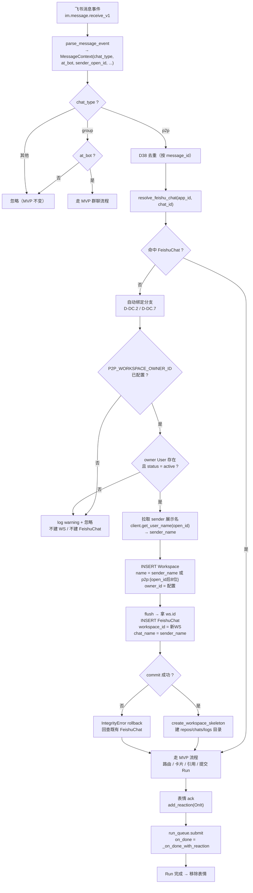

# P2 - 单聊触发支持：设计文档

> 子主题：[direct-chat](./)。需求见 [spec.md](./spec.md)。
> P2 总览见 [../README.md](../README.md)；MVP 设计见 [../../mvp/design.md](../../mvp/design.md)。

---

## 1. 整体流程

```
飞书消息事件 (im.message.receive_v1)
  │
  ▼
parse_message_event → MessageContext(chat_type, at_bot, ...)
  │
  ├─ chat_type == "group"
  │     ├─ at_bot=False → 忽略（MVP 不变）
  │     └─ at_bot=True  → 走 MVP 群聊流程（不变）
  │
  └─ chat_type == "p2p"  ← P2 新增分支
        │
        ├─ D38 去重（不变）
        │
        ├─ resolve_feishu_chat(app_id, chat_id)
        │     ├─ 命中 → 走 MVP 流程（路由 / 卡片 / 引用 / 提交 Run）
        │     └─ 未命中 → 自动绑定分支 ↓
        │
        ├─ 自动绑定（D-DC.2 / D-DC.7）：
        │     ├─ P2P_WORKSPACE_OWNER_ID 未配置 → log warning + 忽略
        │     ├─ owner User 不存在 / 已停用 → log warning + 忽略（NF2.5）
        │     ├─ 拉取 sender 展示名：client.get_user_name(sender_open_id) → sender_name
        │     ├─ INSERT Workspace(name=sender_name 或 fallback p2p:{open_id[-8:]}, owner_id=配置)
        │     │     + INSERT FeishuChat(app_id, chat_id, workspace_id=新WS, chat_name=sender_name)
        │     │     + create_workspace_skeleton(新WS)
        │     └─ 唯一键冲突 → rollback + 回查既有记录（NF2.4，新建 WS 一并回滚无孤儿）
        │
        ├─ 表情 ack（复用 emoji-reply：add_reaction OnIt）
        │
        └─ run_queue.submit(..., on_done=emoji-reply 的 _on_done_with_reaction)
              └─ Run 完成 → 移除表情（不变）
```

### 1.1 Mermaid 流程图



---

## 2. 关键决策

### D-DC.1: 按 `chat_type` 分支，单聊无需 @

- **规则**：handler 入口按 `chat_type` 分支
  - `"group"` → 维持 MVP 群聊约束（必须 `at_bot`）
  - `"p2p"` → 跳过 @ 校验，每条消息都触发
- **理由**：单聊里 @ 概念不存在（机器人本身就是会话对象），强行要求 @ 反而违反飞书交互直觉
- **代码位置**：`backend/app/feishu/handler.py:109-112` 的 if 条件改造为分支判断

### D-DC.2: 自动绑定（首次见到即建 WS + FeishuChat）

- **规则**：未绑定的 p2p chat_id 不再直接忽略，而是**新建一个专属 Workspace + FeishuChat**绑定到该 WS（D-DC.7 演进：从"共享默认 WS"改为"按用户独立 WS"）
- **唯一性保证**：依赖 FeishuChat 既有 `(app_id, chat_id)` 唯一键（D8）；并发首次消息时 INSERT 失败的那一方 rollback（新建的 WS 一并回滚，无孤儿）后回查既有记录，不影响一致性
- **WS 粒度**：一个 `(app_id, chat_id)` 对应一个 WS；单 App 部署下即"每人一个 WS"。跨 App 同人因 `open_id` 本身按 App 维度区分会产生两个 WS（事件不含 `union_id`，不做跨 App 去重）
- **WS 命名**：优先使用 sender 展示名（`client.get_user_name(sender_open_id)` → contact v3 API），与群聊 WS 命名一致——仅一个有意义的名字，不标记 "p2p:" 前缀；拉取失败时 fallback `f"p2p:{sender_open_id[-8:]}"`；空 sender fallback `"p2p:anonymous"`
- **chat_name 取值**：同 WS 命名——优先 sender 展示名，fallback `p2p:{open_id[-8:]}` / `None`
- **设计理念**：私聊和群聊应一视同仁，仅触发方式不同（群聊需 @，单聊直接触发）；WS 命名不区分来源，admin 在列表看到的是有意义的名字（如 "张三"），与手动建的群聊 WS 无异
- **新 WS 初始状态**：无 repo / skill / mcp 挂载；`resolve_cwd` 返回 `""`，`build_registry` 仅内置 6 工具 + AgentTool。p2p 用户获得干净沙箱；admin 后续可按需挂载资源

### D-DC.3: 自动建 WS 的 owner 配置

- **规则**：新增 settings 项 `P2P_WORKSPACE_OWNER_ID: int | None`，auto-created p2p WS 的 `owner_id` 指向该 User；`None` 时关闭单聊自动接受
- **不做的事**：
  - 不按 App 区分 owner（避免配置矩阵膨胀）
  - 不按 sender 路由到不同 owner（违背"无权限模型"原则）
- **理由**：`Workspace.owner_id` NOT NULL（`ondelete=RESTRICT`），auto-created WS 必须有合法 owner；复用既有 admin user 作为所有 p2p WS 的 owner，避免给 `User` 加 `feishu_open_id` 列（schema 迁移成本）。p2p 用户的隔离由 WS 维度实现，与 owner 归属解耦
- **owner 校验**：自动绑定时 `db.get(User, owner_id)`，不存在或 `status != active` → 返回 None（NF2.5），不建 WS
- **配置方式**：环境变量 `P2P_WORKSPACE_OWNER_ID`，缺省为 `None`（关闭单聊自动绑定）

### D-DC.4: 复用既有 MVP / P2 全部机制

| 机制 | 来源 | 单聊复用方式 |
|---|---|---|
| 路由 `(app_id, chat_id) → FeishuChat` | MVP D8 / `router.py` | 不变，自动绑定后走同一查询 |
| D38 去重 | MVP | 不变 |
| D39 引用回复 | MVP | 单聊里引用上一条消息同样生效 |
| 卡片生命周期（排队 / 思考中 / 完成） | MVP T4.5 | 不变 |
| WS 写锁串行 | MVP D20 | 单聊与群聊触发同一 WS 时共享队列 |
| OnIt 表情 ack + 移除 | P2 emoji-reply F2.1–F2.6 | 不变，handler 入口对 p2p 分支同样调 `add_reaction` |

**含义**：D-DC.x 不引入新的卡片 / 表情 / 路由分支逻辑，仅在"是否触发 Run"和"未绑定时是否自动建记录"两点上放宽。

### D-DC.5: 显式覆盖 MVP F3.1.2 / D13

- **覆盖点**：
  - MVP F3.1.2 "支持群聊场景（MVP 暂不支持私聊）" → P2 后放开 p2p
  - MVP D13 "聊天场景 = 群聊为主（MVP）" → P2 后群聊 + 单聊并行
- **不修改 MVP 文档**：MVP 文档保持原状作为一期快照；P2 的覆盖关系在本设计文档中显式声明，避免回溯改写历史决策
- **理由**：保留 MVP 文档的"时间点真相"，让 P2 的演进可追溯

### D-DC.6: 资源风险与缓解策略

- **风险**：
  - 任意好友可触发 Run → 恶意用户耗尽 LLM 配额
  - ~~默认 WS 被多个 sender 共享 → memory 融合污染~~（D-DC.7 后已消除：按用户独立 WS，天然隔离）
- **缓解（MVP 阶段）**：
  - **不做限流**：依赖 owner 自行控制机器人好友列表（飞书侧拉黑即可切断）
  - **不做 sender 白名单**：与 D21 "无权限模型"原则一致
  - **观测**：auto-created WS 名称含 sender 后 8 位，owner 可在后台识别异常 sender 并手工解绑 / 删 WS
  - **WS 清理**：异常用户的 WS 可直接删除（CASCADE 清理 FeishuChat / Run / 目录骨架）
- **P3 演进方向（不在本期）**：
  - sender 白名单（owner 配置允许触发的 open_id 列表）
  - rate limit（按 sender / 按 App 限频）
  - WS 生命周期管理（长期不活跃的 p2p WS 自动归档 / 回收）

### D-DC.7: 按用户独立 WS（演进自 D-DC.2 / D-DC.3 初版共享 WS）

- **背景**：D-DC.2 / D-DC.3 初版采用"所有 p2p 消息共享一个默认 WS"（`DEFAULT_P2P_WORKSPACE_ID`）。验证阶段发现：占用一个正常 WS 作为所有单聊的回收站，语义混乱，且不同 sender 的 Run 历史在 admin 视角混在一起难以区分
- **决策**：改为**首次见到 p2p chat 时自动新建专属 WS**，一人一个（单 App 下 = 一个 `open_id` 对应一个 WS），`owner_id` 由 `P2P_WORKSPACE_OWNER_ID` 指定
- **与初版的差异**：
  | 维度 | 初版（D-DC.2 / D-DC.3） | 本期（D-DC.7） |
  |---|---|---|
  | WS 数量 | 1 个共享 | N 个（按用户） |
  | 配置项 | `DEFAULT_P2P_WORKSPACE_ID` → WS id | `P2P_WORKSPACE_OWNER_ID` → User id |
  | memory 隔离 | 共享（D22 同等接受） | 天然隔离（每 WS 独立 Run 历史 / 上下文） |
  | admin 视角 | 所有 sender 混在一个 WS | 按 WS 区分 sender，可单独清理 |
  | 建对象 | 仅 FeishuChat | Workspace + FeishuChat + 目录骨架 |
- **新增副作用**：`create_workspace_skeleton(ws_id)` 建 `repos/chats/logs` 目录；新 WS 无 repo 挂载，`resolve_cwd` 返回 `""`（runtime 已支持空 cwd，退化为 `repos/`）
- **不做的事**：
  - 不给 `User` 加 `feishu_open_id` 列（schema 迁移成本，owner 复用既有 admin 即可）
  - 不做跨 App 去重（需 `union_id`，事件未提供；单 App 部署下无此问题）
  - 不做 per-user 限流 / 白名单（留 P3）

---

## 3. 涉及文件

| 文件 | 改动 | 说明 |
|---|---|---|
| `backend/app/config.py` | `DEFAULT_P2P_WORKSPACE_ID` → `P2P_WORKSPACE_OWNER_ID: int \| None` | auto-created p2p WS 的 owner user id，env 注入；语义从"指向 WS"改为"指向 owner" |
| `backend/app/feishu/client.py` | 新增 `get_user_name(open_id)` 方法 | 调 contact v3 API 拉 sender 展示名，用于 p2p WS 有意义命名；无权限 / 失败返回 None |
| `backend/app/feishu/handler.py` | 入口分支改造 + 自动绑定调用 + sender 名拉取 | `chat_type` 分支判断、p2p 未命中时先 `client.get_user_name` 拉展示名再调 `auto_bind_p2p_chat`（传 `sender_name`） |
| `backend/app/feishu/router.py` | `auto_bind_p2p_chat` 改造 | 新建 Workspace + FeishuChat + 目录骨架；含唯一键冲突降级（rollback 含新建 WS）；WS 名优先用 `sender_name`，fallback `p2p:{open_id[-8:]}` |
| `backend/app/workspace/fs.py` | 复用 `create_workspace_skeleton` | 已有实现，无需改动；router 在 commit 后调用 |
| `backend/tests/test_handler_p2p.py` | 改写 auto_bind 用例 + handler 集成 | owner 未配置 / 已删 → None；sender_name 提供 → WS 名=sender_name；拉取失败 → fallback；冲突 → 降级不产生重复 WS |
| `backend/tests/test_handler.py` | `_isolated` fixture 更新配置项名 + `_FakeClient` 加 `get_user_name` | `default_p2p_workspace_id` → `p2p_workspace_owner_id`；fake client 补 `get_user_name` 返回 None |

> 不需要 DB 迁移：Workspace / FeishuChat 表结构不变（D-DC.7 复用既有字段，仅新增 INSERT Workspace 行）。

---

## 4. 自动绑定伪代码

`router.py` 改造后：

```python
from app.db.models import FeishuChat, User, UserStatus, Workspace
from app.workspace.fs import create_workspace_skeleton


async def auto_bind_p2p_chat(
    db: AsyncSession,
    app_id: str,
    chat_id: str,
    sender_open_id: str,
    owner_id: int | None,
    sender_name: str | None = None,
) -> FeishuChat | None:
    """p2p chat 未绑定时自动建专属 WS + FeishuChat（D-DC.2 / D-DC.7）；失败返回 None。

    - owner_id 为 None → 返回 None（未开启自动接受）
    - owner User 不存在 / 已停用 → 返回 None（NF2.5）
    - sender_name 提供时用作 WS 名 + chat_name（与群聊一致，仅触发方式不同）
    - 唯一键冲突（并发首次消息）→ rollback（含新建 WS）后回查既有记录
    - 其他异常 → rollback 后返回 None（不向上抛，NF2.4）
    """
    if owner_id is None:
        return None
    owner = await db.get(User, owner_id)
    if owner is None or owner.status != UserStatus.active.value:
        return None

    if sender_name:
        ws_name = sender_name
        chat_name = sender_name
    elif sender_open_id:
        ws_name = f"p2p:{sender_open_id[-8:]}"
        chat_name = ws_name
    else:
        ws_name = "p2p:anonymous"
        chat_name = None
    ws = Workspace(name=ws_name, owner_id=owner_id)
    db.add(ws)
    await db.flush()  # 拿到 ws.id 再建 FeishuChat
    chat = FeishuChat(
        app_id=app_id,
        chat_id=chat_id,
        workspace_id=ws.id,
        chat_name=chat_name,
    )
    db.add(chat)
    try:
        await db.commit()
        await db.refresh(ws)
        await db.refresh(chat)
        create_workspace_skeleton(ws.id)  # commit 后建目录，失败仅 log（DB 已落地）
        return chat
    except IntegrityError:  # 唯一键冲突 = 并发首次消息，对方已建记录
        await db.rollback()
        return await resolve_feishu_chat(db, app_id, chat_id)
    except Exception:
        await db.rollback()
        return None
```

`handler.py` 入口分支改造（伪代码，仅示意关键差异）：

```python
# 旧：
if ctx.chat_type != "group" or not ctx.at_bot:
    return

# 新：
if ctx.chat_type == "group":
    if not ctx.at_bot:
        return
elif ctx.chat_type == "p2p":
    pass  # 跳过 @ 校验
else:
    return  # 未知 chat_type，忽略

# ... D38 去重后 ...
client = FeishuClient(app_id, app_secret)
sender_name = None
async with async_session_factory() as db:
    chat = await resolve_feishu_chat(db, ctx.app_id, ctx.chat_id)
    if chat is None and ctx.chat_type == "p2p":
        if ctx.sender_open_id:
            try:
                sender_name = await client.get_user_name(ctx.sender_open_id)
            except Exception:
                log.warning("get_user_name failed", exc_info=True)
        chat = await auto_bind_p2p_chat(
            db, ctx.app_id, ctx.chat_id, ctx.sender_open_id,
            settings.p2p_workspace_owner_id,
            sender_name=sender_name,
        )
    if chat is None:
        log.info("unbound chat, ignore: app=%s chat=%s", ctx.app_id, ctx.chat_id)
        return
    # ... 原 MVP 路由 / 卡片 / 引用 / 提交流程不变 ...
```

---

## 5. 配置示例

`.env` 追加：

```
# 单聊自动建 WS 的 owner（不配置则关闭单聊自动接受）
P2P_WORKSPACE_OWNER_ID=1
```

> 该 id 指向既有 `users` 表中的一条 active 记录（通常为 admin）。首次私聊会以该 user 为 owner 新建一个以 sender 展示名命名的 WS（如 "张三"），contact v3 API 无权限时 fallback `p2p:{open_id后8位}`。

部署侧需在 `serve.sh` / `deploy/` 中将该变量透传到容器（与既有 `ANTHROPIC_API_KEY` 等配置项同渠道）。

---

## 6. 测试覆盖要点

| 用例 | 期望 |
|---|---|
| p2p 消息 + 已绑定 FeishuChat | 走 MVP 流程，提交 Run（不新建 WS） |
| p2p 消息 + 未绑定 + 配置 owner | 新建 WS（owner=配置，name=sender 展示名）+ FeishuChat + 目录骨架，提交 Run |
| p2p 消息 + 未绑定 + name 拉取成功 | WS name = sender 展示名（如 "张三"），chat_name 同 |
| p2p 消息 + 未绑定 + name 拉取失败 / 无权限 | WS name fallback `p2p:{open_id[-8:]}` |
| p2p 消息 + 未绑定 + 未配置 owner | log warning + 忽略，不建 WS / 不建 FeishuChat |
| p2p 消息 + 未绑定 + owner 已删除 / 停用 | 忽略，不建记录（NF2.5） |
| p2p 消息 + 并发首次消息 | 唯一键冲突 → rollback（含新建 WS）+ 回查既有记录，不抛异常、不产生重复 WS（NF2.4） |
| p2p 消息 + 空 sender_open_id | WS name fallback `"p2p:anonymous"`，chat_name=None |
| 新建 WS 初始状态 | 无 repo 挂载，`resolve_cwd` 返回 `""`，`build_registry` 仅内置 6 工具 + AgentTool |
| p2p 消息触发 Run | OnIt 表情 ack + 完成后移除（F2.11 复用 emoji-reply） |
| 群聊无 @ 消息 | 忽略（不变） |
| 群聊 + @ 消息 | 走 MVP 群聊流程（不变） |

---

## 7. 与 P2 emoji-reply 的关系

单聊分支在 handler 入口与 emoji-reply 共享同一段 `add_reaction` / `_on_done_with_reaction` 代码，不重复实现：

- emoji-reply 已经把表情 ack 逻辑下沉到 `handle_message` 主流程（而非 group 专用分支）
- direct-chat 仅扩展触发条件 + 自动绑定，对 emoji 逻辑零改动

详见 emoji-reply [design.md §1](../emoji-reply/design.md) 流程图——本文档的"表情 ack"节点直接复用其实现。
