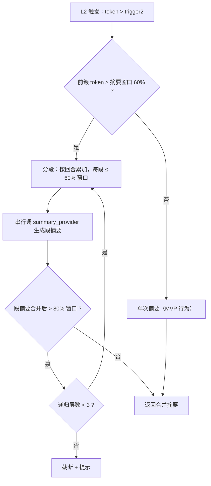

# P3 - 上下文工程增强：设计

> 子主题：[context-eng](./)。规格见 [spec.md](./spec.md)。
> 一期 MVP 上下文管理设计见 [../../mvp/design.md §D34](../../mvp/design.md)（L0-L4 四道防线）。

---

## 0. 现状回顾

### 0.1 L0-L4 四道防线（MVP D34，已有）

```
每轮工具调用前 ContextManager.manage(messages)：

  L0  源头节流      Bash stdout ≤20K / Read ≤2000 行          （builtin 工具层）
  L1  clearing      token > 50% 窗口 → 旧 tool_result 占位      （context.py:152）
  L2  compaction    token > 75% 窗口 → 旧前缀摘要替换           （context.py:109）
  L3  memory 联动   L2 后注入 user 消息提示写 memory/           （context.py:92）
  L4  硬兜底        三层后仍 > 95% → ContextLimitError          （context.py:95）
```

### 0.2 跨 session 加载（MVP，已有）

```python
# run.py:69 load_chat_history
1. 查 DB：最近 1 个 completed session 的 id
2. 读 JSONL：data/workspaces/{ws_id}/chats/{chat_id}/sessions/{sid}.jsonl
3. 过滤 tool_result 与 tool_calls（跨 session 无用 + 配对校验风险）
4. 取最近 N 条（chat_history_max_messages=20）
5. 返回 [history] + [当前 user message] 给 Loop
```

### 0.3 缺口（本子主题解决）

| # | 缺口 | 影响 | 对应决策 |
|---|---|---|---|
| 1 | 只看最近 1 session | 隔天上下文断 | D-CE.1 滑动窗口 |
| 2 | L2 单次摘要超窗口静默失败 | 长 Run 频繁 L4 报错 | D-CE.2 递归摘要 |
| 3 | OpenAI 系 token 估算误差 ±30% | L1/L2 触发时机偏 | D-CE.3 tiktoken |
| 4 | context_window 硬编码 | 换 model 阈值不准 | D-CE.4 ModelRegistry |

---

## 1. 整体架构

```
┌─────────────────────────────────────────────────────────────┐
│  Run 结束（status=completed）                                │
│   └─ 异步任务：generate_session_summary(session_id)         │
│       ├─ 读 JSONL 原文                                       │
│       ├─ summary_provider.chat(原文, compact_instructions)  │
│       └─ INSERT session_summaries(session_id, summary, ...) │
│                        ↓                                     │
┌─────────────────────────────────────────────────────────────┐
│  新 Run 启动                                                 │
│   └─ load_chat_history（重写）                               │
│       ├─ 查 DB：最近 N 个 session_summaries（token 预算内）  │
│       ├─ 拼接摘要为 user 消息前缀                            │
│       ├─ 读最近 1 session JSONL 原文（过滤 tool_result）     │
│       └─ 返回 [摘要前缀] + [原文] + [当前 user message]      │
│                        ↓                                     │
┌─────────────────────────────────────────────────────────────┐
│  Loop 内每轮工具调用前                                       │
│   └─ ContextManager.manage(messages)（L1-L4 编排不变）       │
│       └─ L2 _compact 改为递归摘要（D-CE.2）                  │
└─────────────────────────────────────────────────────────────┘
```

---

## 2. 关键决策

### D-CE.1: 跨 session 滑动窗口（session 摘要链）

- **规则**：每个 Run 完成后异步生成 session 摘要，落 `session_summaries` 表；新 Run 启动时按 token 预算加载最近 N 条摘要 + 最近 1 session 原文
- **表结构**（新）：

  | 列 | 类型 | 说明 |
  |---|---|---|
  | session_id | int PK → sessions.id (ON DELETE CASCADE) | 1:1 附属 |
  | summary_text | TEXT | 摘要正文（markdown） |
  | token_count | int | 摘要 token 数（用于预算计算） |
  | summary_model | varchar(64) | 生成摘要用的 model 名 |
  | created_at | timestamptz | 默认 now() |

- **摘要生成时机**：Run status 置为 `completed` 之后，通过 `task_runner` 提交异步任务，不阻塞用户回复卡片
- **摘要生成失败**：log warning + 不写 DB；该 session 在历史中表现为"无摘要"，被跳过
- **加载逻辑**：
  ```
  budget = context_window * summary_budget_pct  (默认 0.25)
  summaries = SELECT * FROM session_summaries
              WHERE session.feishu_chat_id = ?
              ORDER BY session.id DESC
  从最近往前累加 token_count ≤ budget，取 N 条
  拼成一条 user 消息：[历史摘要（N 个 session）]\n{summary_N}\n...\n{summary_1}
  ```
- **不做的事**：
  - 不做嵌入检索（P4）
  - 不做摘要回溯修改（历史摘要不可变）
  - 不做跨 chat 摘要共享（摘要按 feishu_chat_id 隔离）
- **理由**：file-based 摘要查询效率低且无法按 token 预算动态截取；DB 表便于 `ORDER BY id DESC LIMIT N` + `token_count` 累加

### D-CE.2: L2 递归摘要

- **规则**：L2 compaction 触发时，若前缀 token > 摘要模型窗口的 60%，分段递归摘要
- **分段策略**：
  ```
  seg_budget = summary_window * 0.6   # 每段预算（留 40% 给指令+输出）
  segments = split_by_turns(prefix, seg_budget)
  # 分段边界对齐到完整回合（不切断 tool_use/tool_result 对）
  seg_summaries = [summary_provider.chat(seg) for seg in segments]
  merged = "\n\n---\n\n".join(seg_summaries)
  if token_count(merged) > summary_window * 0.8:
      return recursive_compact(merged, depth+1)  # 再递归一层
  return merged
  ```
- **递归上限**：3 层。超过则取当前结果 + 截断提示 `[递归上限已达，早期历史可能被截断]`
- **单段失败**：该段降级为截断（保留首 500 + 尾 500 字符 + `[中段省略]`），不整体 skip
- **分段实现**：遍历 messages，按回合（user/assistant 一对）累加 token，达到 seg_budget 就切一段
- **不做的事**：
  - 不做并行分段摘要（分段间无依赖，但 LLM 调用并发控制复杂，MVP 串行）
  - 不做分段摘要缓存（同一段在不同 Run 里可能被再次摘要，但频次低，不值得缓存）
- **理由**：单次摘要失败的根本原因是前缀 > 摘要窗口；分段后每段必然 ≤ 60% 窗口，保证不超

### D-CE.3: tiktoken 集成（OpenAI 兼容 provider 精确计数）

- **规则**：`OpenAICompatibleProvider.count_tokens` 改为优先用 `tiktoken`
  ```python
  def count_tokens(self, messages):
      enc = self._get_encoding()  # 按 model_name 选，fallback cl100k_base
      if enc is None:
          return TokenCount(input_tokens=sum(len(m.content)//4 for m in messages))
      total = sum(len(enc.encode(m.content or "")) for m in messages)
      return TokenCount(input_tokens=total)
  ```
- **encoding 选择**：
  - `gpt-4*` / `gpt-3.5-turbo*` → `cl100k_base`
  - `gpt-4o*` / `o1*` → `o200k_base`
  - 其他（GLM / DeepSeek / Qwen 等国产模型）→ `cl100k_base`（近似，误差可接受）
- **optional dependency**：`tiktoken` 不写入 `requirements.txt` 强制依赖；`import` 失败时 fallback 到 `len//4`
- **缓存**：encoding 实例在 provider 内缓存（`@lru_cache` 或实例属性），避免重复加载
- **不做的事**：
  - 不为 Anthropic 接入 tiktoken（已有官方 `count_tokens` API，更精确）
  - 不为 tool_calls / reasoning 字段单独计数（只数 content，工具调用占比小）
- **理由**：tiktoken 是 OpenAI 官方 tokenizer，对 OpenAI 系 model 误差 < 1%；国产模型无公开 tokenizer，cl100k_base 近似误差 < 5%，远优于 `len//4` 的 ±30%

### D-CE.4: ModelRegistry（per-model context_window）

- **规则**：新增 `app/providers/registry.py`，内置常见 model 元数据：

  ```python
  MODEL_REGISTRY: dict[str, ModelMeta] = {
      "claude-sonnet-4-20250514": ModelMeta(context_window=200_000, max_output=8192),
      "claude-opus-4-20250514":   ModelMeta(context_window=200_000, max_output=4096),
      "claude-3-5-haiku-20241022":ModelMeta(context_window=200_000, max_output=8192),
      "gpt-4o":                   ModelMeta(context_window=128_000, max_output=16384),
      "gpt-4o-mini":              ModelMeta(context_window=128_000, max_output=16384),
      "glm-4-plus":               ModelMeta(context_window=128_000, max_output=4096),
      "glm-4-air":                ModelMeta(context_window=128_000, max_output=4096),
      "deepseek-chat":            ModelMeta(context_window=64_000,  max_output=4096),
      "deepseek-reasoner":        ModelMeta(context_window=64_000,  max_output=4096),
      # ...
  }
  ```

- **查询**：provider 构造时 `meta = MODEL_REGISTRY.get(model_name)`；`None` 走 `_FALLBACK_CTX`
- **override**：环境变量 `MODEL_OVERRIDES`（JSON）合并到 registry，便于新 model 上线无需发版
  ```
  MODEL_OVERRIDES={"my-custom-model":{"context_window":32000,"max_output":4096}}
  ```
- **不做的事**：
  - 不做 DB 表（model 列表相对稳定，DB 增加运维成本）
  - 不做运行时动态查询（不调 OpenAI / Anthropic API 拉 model 列表，避免网络依赖）
  - 不改 `max_tokens=4096` 硬编码（P3 二期再考虑用 `max_output`）
- **理由**：硬编码导致切 model 时 L1/L2 阈值偏离设计；registry 是纯内存 dict，零运维成本

### D-CE.5: ContextConfig 管理后台 UI

- **规则**：WorkspaceDetailView 新增「上下文管理」tab，表单化编辑 `ContextConfig`，替代当前 Overview tab 里的 raw JSON textarea（`editConfig`）
- **表单字段**（对应 `ContextConfig` 全部 11 项）：

  | 字段 | 控件 | 范围 / 选项 | 说明 |
  |---|---|---|---|
  | `enabled` | switch | on/off | 主开关 |
  | `trigger1` | slider | 0.1-0.8（步进 0.05） | L1 阈值，显示为 `50%` |
  | `trigger2` | slider | 0.2-0.9（步进 0.05） | L2 阈值，需 > trigger1 |
  | `clear_keep` | number input | 1-20 | L1 保留最近 N 个 tool_result |
  | `compact_recent` | number input | 1-20 | L2 保留最近 M 轮原文 |
  | `summary_provider` | select | anthropic / openai_compatible | 摘要用 provider |
  | `summary_model` | text input | placeholder=默认 model | 摘要 model override |
  | `compact_instructions` | textarea + 「重置默认」按钮 | 任意文本 | 摘要指令 |
  | `exclude_tools` | tag input | 工具名列表 | L1 不清的工具 |
  | `summary_budget_pct` | slider | 0-0.5（步进 0.05） | 跨 session 摘要预算（P3 新增） |
  | `compact_recursive` | switch | on/off | L2 递归摘要开关（P3 新增） |

- **前端校验**（保存前）：
  - `trigger1 < trigger2 < 0.95`
  - `clear_keep ≥ 1` 且 `compact_recent ≥ 1`
  - `summary_budget_pct ∈ [0, 0.5]`
  - 校验失败标红 + 禁用保存按钮
- **保存**：`PATCH /workspaces/{id}` body `{"context_config": {...}}`；后端 `from_ws` 容错解析
- **重置默认**：按钮一键填入 `ContextConfig().model_dump()`；用户仍需点保存才生效
- **不做的事**：
  - 不做预览（不模拟 L1/L2 触发效果）
  - 不做预设模板（"保守 / 激进 / 省成本" 留 P4）
  - 不做 per-chat 粒度（仍是 WS 级配置）
- **理由**：raw JSON 对非开发者不友好；表单化降低误配概率 + 字段校验前置减少 422

### D-CE.6: 模型切换管理后台 UI（per-WS model_config）

- **规则**：Workspace 新增 `model_config` JSONB 字段；WorkspaceDetailView 新增「模型配置」tab；`make_provider()` 改为优先从 WS 配置构造
- **DB 字段**（新）：

  ```python
  # Workspace model 新增
  model_config: Mapped[dict | None] = mapped_column(JSONB, nullable=True)
  ```

- **`model_config` schema**：

  | 字段 | 类型 | 说明 |
  |---|---|---|
  | `provider` | "anthropic" \| "openai_compatible" | provider 类型 |
  | `model` | str | model_name（从 ModelRegistry 查 context_window） |
  | `api_base_url` | str \| None | openai_compatible 的 base_url；None 走 settings |
  | `api_key_enc` | str \| None | 加密后的 API key；None 走 settings 全局 key |

- **`make_provider()` 改造**：

  ```python
  def make_provider(ws_model_config: dict | None = None) -> Provider:
      if ws_model_config:
          cfg = ModelConfig.from_ws(ws_model_config)
          if cfg.provider == "openai_compatible":
              return OpenAICompatibleProvider(
                  model=cfg.model,
                  base_url=cfg.api_base_url or settings.openai_compatible_base_url,
                  api_key=cfg.api_key or settings.openai_compatible_api_key,
              )
          else:  # anthropic
              return AnthropicProvider(
                  model=cfg.model,
                  api_key=cfg.api_key or settings.anthropic_api_key,
              )
      # fallback 到全局 settings（现有行为）
      if (settings.openai_compatible_api_key
          and settings.openai_compatible_base_url
          and settings.openai_compatible_model):
          return OpenAICompatibleProvider(model=settings.openai_compatible_model)
      return AnthropicProvider()
  ```

- **UI 控件**：
  - `provider`：radio group（anthropic / openai_compatible）
  - `model`：text input + `<datalist>` 从 `MODEL_REGISTRY` keys 提供建议
  - `api_base_url`：text input，provider=anthropic 时禁用
  - `api_key`：password input，placeholder "留空用全局 key"；API 返回 `has_api_key: bool`，已填时显示 "已配置（不回显）"
- **API 变更**：
  - `GET /workspaces/{id}` 返回 `model_config` 时 `api_key_enc` 不回显，改为 `has_api_key: bool`
  - `PATCH /workspaces/{id}` 接受 `model_config` 对象；`api_key` 字段非空时加密存储，为空时不覆盖既有 key
- **`run.py` 调用点**：`_execute_run` 构造 provider 时传 `ws.model_config`；`make_summary_provider` 不动（仍走 `ContextConfig.summary_provider`）
- **不做的事**：
  - 不做多 model 路由（一个 WS 同时只用一个主 model）
  - 不做 model 测试连通性（"测试" 按钮留 P4）
  - 不做 API key 轮询 / 负载均衡
  - 不改 `make_summary_provider`（摘要 model 仍由 `ContextConfig` 控制）
- **理由**：全局 settings 改 model 需要重启服务；per-WS 配置支持不同 WS 用不同 model（如代码 WS 用 Claude、聊天 WS 用 GLM 降本），且热切换无需重启

---

## 3. ContextConfig 扩展

`ContextConfig`（`context_config.py`）新增 2 个字段：

| 字段 | 类型 | 默认 | 说明 |
|---|---|---|---|
| `summary_budget_pct` | float | 0.25 | 跨 session 摘要占 context_window 的预算百分比 |
| `compact_recursive` | bool | True | L2 是否启用递归摘要（False 回退 MVP 单次摘要行为） |

其余字段（`trigger1` / `trigger2` / `clear_keep` / `compact_recent` / `summary_provider` / `summary_model` / `compact_instructions` / `exclude_tools`）不变。

---

## 4. 数据流

### 4.1 Run 完成 → 异步生成 session 摘要

```mermaid
sequenceDiagram
    participant Loop as Agent Loop
    participant Run as run.py
    participant TaskRunner as task_runner
    participant Summary as summary worker
    participant DB as DB

    Loop->>Run: Run 完成
    Run->>Run: status=completed, save JSONL
    Run->>TaskRunner: submit(generate_session_summary, session_id)
    Run-->>Loop: 返回（不阻塞）

    TaskRunner->>Summary: 异步执行
    Summary->>DB: 查 session 的 JSONL 路径
    Summary->>Summary: 读 JSONL 原文
    Summary->>Summary: summary_provider.chat(原文, instructions)
    Summary->>DB: INSERT session_summaries
    Summary-->>TaskRunner: 完成（失败仅 log）
```

### 4.2 新 Run 启动 → 滑动窗口加载

```mermaid
sequenceDiagram
    participant Run as run.py
    participant DB as DB
    participant FS as 文件系统
    participant Loop as Agent Loop

    Run->>DB: 查最近 N 个 session_summaries（token 预算内）
    DB-->>Run: [summary_M, ..., summary_1]
    Run->>Run: 拼成 user 消息 [历史摘要]

    Run->>DB: 查最近 1 completed session id
    DB-->>Run: prev_sid
    Run->>FS: 读 {prev_sid}.jsonl
    FS-->>Run: 原文 messages（过滤 tool_result）

    Run->>Loop: messages=[摘要] + [原文] + [当前 user]
    Loop->>Loop: ContextManager.manage(messages)
```

### 4.3 L2 递归摘要



---

## 5. 涉及文件

| 文件 | 改动 | 说明 |
|---|---|---|
| `backend/app/db/models/workspace.py` | 新增 `model_config` JSONB 字段 | per-WS 模型配置（D-CE.6） |
| `backend/app/db/models/session_run.py` | 新增 `SessionSummary` model | 1:1 附属 sessions，ON DELETE CASCADE |
| `backend/alembic/versions/xxx_add_session_summaries.py` | 新 migration | 建 `session_summaries` 表 + `workspaces.model_config` 列 |
| `backend/app/agent/context_config.py` | 新增 2 字段 | `summary_budget_pct` / `compact_recursive` |
| `backend/app/agent/model_config.py` | 新建 | `ModelConfig.from_ws()` 容错解析（对齐 `ContextConfig.from_ws`） |
| `backend/app/agent/context.py` | `_compact` 改造 | 支持递归分段摘要 |
| `backend/app/agent/run.py` | `load_chat_history` 重写 + provider 调用点传 `ws.model_config` | 滑动窗口 + per-WS provider |
| `backend/app/agent/session_summary.py` | 新建 | `generate_session_summary` 异步任务 |
| `backend/app/agent/runtime.py` | `make_provider()` 改造 | 接受 `ws_model_config` 参数，优先 WS 配置 |
| `backend/app/providers/registry.py` | 新建 | `MODEL_REGISTRY` + `ModelMeta` + `/api/models` 建议 |
| `backend/app/providers/openai_compatible_provider.py` | `count_tokens` 改造 + 构造接受 `api_key` / `base_url` | tiktoken 优先 + per-WS 配置 |
| `backend/app/providers/anthropic_provider.py` | `context_window` 改造 + 构造接受 `model` / `api_key` | 从 registry 查 + per-WS 配置 |
| `backend/app/providers/base.py` | `Provider.__init__` 接受 model_name | 用于 registry 查询 |
| `backend/app/api/workspaces.py` | `PATCH` 接受 `model_config`；`GET` 返回 `has_api_key` | 不回显明文 key |
| `backend/app/api/models.py` | 新建 | `GET /api/models` 返回 `MODEL_REGISTRY` 列表供前端 datalist |
| `backend/tests/test_context.py` | 新建 | L1/L2/递归摘要单元测试 |
| `backend/tests/test_session_summary.py` | 新建 | 摘要生成 + 滑动窗口加载测试 |
| `backend/tests/test_token_count.py` | 新建 | tiktoken 计数测试 |
| `backend/tests/test_model_config.py` | 新建 | `ModelConfig.from_ws` + `make_provider(ws_config)` 测试 |
| `frontend/src/views/workspaces/WorkspaceDetailView.vue` | 新增 2 个 tab + 改 Overview | 「上下文管理」+「模型配置」tab，Overview 移除 raw JSON textarea |
| `frontend/src/api/workspaces.ts` | 类型更新 | `WorkspaceDetail` 加 `model_config` / `has_api_key` 字段 |
| `frontend/src/api/models.ts` | 新建 | `GET /api/models` 封装 |

---

## 6. 测试策略

### 6.1 单元测试

- **`test_context.py`**（扩展现有）：
  - L2 单次摘要（前缀 ≤ 60% 窗口）—— 回归保护
  - L2 递归摘要（前缀 > 60% 窗口）—— 分段数 / 合并结果 / 层数
  - 递归上限 3 层 —— 超限截断
  - 单段失败降级 —— 截断保留首尾

- **`test_session_summary.py`**（新建）：
  - `generate_session_summary` 正常路径 —— 生成 + 落 DB
  - LLM 调用失败 —— 不落 DB，不抛
  - JSONL 不存在 —— graceful skip
  - `load_chat_history` 滑动窗口 —— N 条摘要 + 1 session 原文
  - token 预算截断 —— 超预算时不加载更多摘要

- **`test_token_count.py`**（新建）：
  - tiktoken 安装时 —— OpenAI provider 用 tiktoken
  - tiktoken 缺失时 —— fallback 到 `len//4`
  - 不同 model 的 encoding 选择

- **`test_model_config.py`**（新建）：
  - `ModelConfig.from_ws` 容错解析（None / 空 / 缺字段 / 非法值）
  - `make_provider(ws_model_config)` 优先用 WS 配置构造 provider
  - `make_provider(None)` fallback 到全局 settings（回归保护）
  - `api_key` 留空时走全局 key；非空时加密存储
  - `GET /workspaces/{id}` 不回显 `api_key_enc`，返回 `has_api_key: bool`
  - `PATCH /workspaces/{id}` 传 `model_config` 时 `api_key` 加密；不传 `api_key` 时保留既有 key

### 6.2 集成测试

- **`test_e2e.py`** 扩展：
  - 连续 3 个 Run（模拟跨 session）—— 第 3 个 Run 的 messages 含前 2 个 session 的摘要
  - 长 Run 触发 L2 递归摘要 —— observability span 记录递归层数 / 段数

### 6.3 手动联调

- 飞书群连续对话 5+ 轮（每轮独立 Run）→ 第 6 轮验证摘要链加载
- 触发 L2 递归摘要（构造超长 context）→ 验证不报 ContextLimitError
- 切换 model（anthropic → glm）→ 验证 context_window 自动调整
- 「上下文管理」tab 修改 trigger1=0.3 → 验证 L1 提前触发（日志 / observability）
- 「模型配置」tab 切到 openai_compatible + glm-4-air → 验证新 Run 用 GLM 且 context_window=128K
- 「模型配置」tab 填 api_key → 验证 GET 返回 `has_api_key=true` 且不回显明文

---

## 7. 风险与缓解

- **摘要质量不稳定**：LLM 生成摘要可能丢失关键信息
  - 缓解：`compact_instructions` 已强调保留代码 / 决策 / TODO；L3 memory 联动兜底重要信息落盘
- **摘要成本**：每个 Run 结束多一次 LLM 调用
  - 缓解：摘要用便宜 model（GLM-4-air / claude-haiku）；摘要预算 25% 窗口，单次成本可控
- **tiktoken 安装问题**：部分环境（如 alpine）tiktoken 编译困难
  - 缓解：optional dependency，缺失时 fallback；Docker 镜像预装
- **递归摘要延迟**：长对话 L2 触发时多段串行调用
  - 缓解：段数通常 ≤ 3，单段摘要 < 5s，总延迟 < 15s 可接受；如需并行留 P4

---

## 8. 演进路径（P4+）

- **嵌入检索**：session 摘要 + memory 文件做向量化，按语义相关性检索而非按时间顺序
- **跨 session tool 调用保留**：摘要中保留关键 tool 调用的结构化摘要（如"调了 Read file.py 拿到 200 行"）
- **max_tokens 可配**：`ContextConfig.max_output_tokens` 替代硬编码 4096
- **并行递归摘要**：分段并行调 summary_provider，降低 L2 延迟
- **摘要缓存**：相同前缀的摘要结果缓存（hash 前缀 → 摘要），避免重复生成
